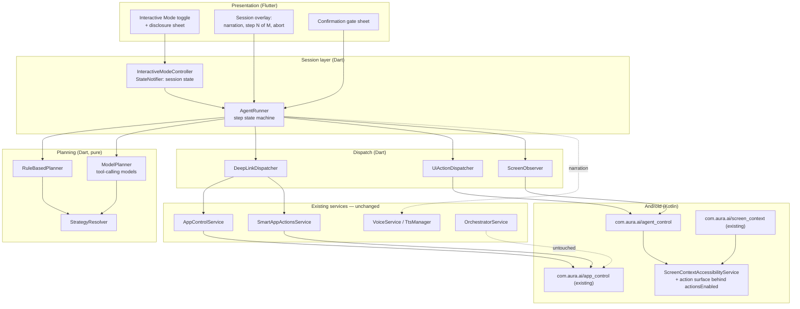
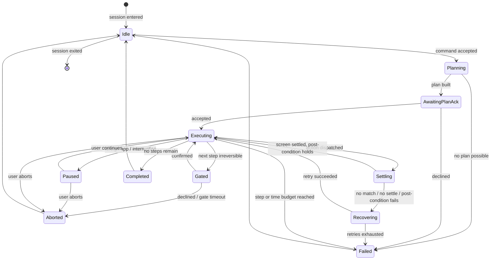

# Design: Interactive Agent Mode

## Overview

Interactive Agent Mode adds a session-scoped execution engine that turns one natural-language command into an
ordered, bounded plan and carries it out across apps, narrating each step and stopping at confirmation gates.

The design is organised around three decisions that follow directly from the requirements:

1. **A plan is data, produced before anything happens.** Planning and execution are separate phases. This is what
   makes the run inspectable (Req 4.3), abortable at a step boundary (Req 10.3), budget-enforceable (Req 12), and
   testable without a device.
2. **Every step resolves to the cheapest strategy that can satisfy it.** Deep-Link Actions reuse the existing
   `AppControlService` / `SmartAppActionsService` intent plumbing and never touch the accessibility tree. UI Actions
   are the fallback. This is the primary answer to the no-lag-on-low-end requirement (Req 5, Req 13).
3. **The accessibility service stays a single service with a hard capability switch.** Rather than register a second
   accessibility service (which would force the user through a second system toggle), the existing
   `ScreenContextAccessibilityService` gains an action surface guarded by a volatile `actionsEnabled` flag. When the
   flag is false — which is always, unless a session is active — the service executes exactly the code path it
   executes today (Req 7.3, 7.4, 14.4).

Nothing in the existing orchestrator is rewired. Interactive Mode is a parallel entry point that sits beside the
existing rule-based and function-calling paths and reuses their handlers where a step maps onto one.

## Architecture

### Component layout



### Run lifecycle



## Key design decisions

### D1. One accessibility service, capability-gated

**Decision.** Extend `ScreenContextAccessibilityService` with an action and query surface, gated by
`@Volatile var actionsEnabled: Boolean = false`. Do not register a second `AccessibilityService`.

**Rationale.** A second service means a second entry in the system accessibility list and a second user toggle,
which is worse onboarding and doubles the event-delivery cost — Android dispatches accessibility events to every
enabled service. Gating keeps the no-session cost at exactly zero (Req 13.8) because the added code is behind a
single boolean read.

**Consequence.** `serviceInfo` is reconfigured on session entry and restored on exit. The existing event types,
`notificationTimeout` of 500 ms, `MAX_TREE_DEPTH` of 30 and `MAX_CONTENT_LENGTH` of 15,000 stay as they are for the
read-only path; the action path uses its own bounded limits and never calls `extractScreenContent`.

**Rejected alternative.** Gesture dispatch via `dispatchGesture` with `canPerformGestures`. Node actions
(`ACTION_CLICK`, `ACTION_SET_TEXT`, `ACTION_SCROLL_FORWARD`) and `performGlobalAction` cover the five required UI
Action types without coordinate-based tapping, which Req 6.4 forbids anyway.

### D2. Screen signature instead of screen text

**Decision.** Change detection uses a cheap `ScreenSignature`, not the 15,000-character text extract.

```
signature = hash(packageName, activityName, orderedIds, nodeCount)
```
where `orderedIds` is drawn from a bounded shallow walk: depth ≤ 6, first 40 nodes, collecting `viewIdResourceName`
when present and otherwise a short text prefix.

**Rationale.** Req 13.6 sets a 150 ms ceiling on a targeted query and Req 7.1 forbids full extraction for change
detection. A bounded shallow walk is O(40) node touches versus potentially thousands.

**Consequence.** A screen whose content changes without any structural change (a chat message arriving) may not
alter the signature. Post-condition checks therefore never rely on the signature alone; a step that needs a value
verified issues a targeted query for it.

### D3. Two planners, one plan format

**Decision.** `RuleBasedPlanner` and `ModelPlanner` both emit the same `AgentPlan`. The runner asks the model
planner only when the active model reports `supportsToolCalling` **and** the rule planner produced nothing, and
races it against a planning timeout, falling back to the rule planner's null result on expiry.

**Rationale.** Req 4.5 and Req 13.4. The rule planner covers the phrasings the app already recognises through
`IntentDetectionService`'s extractors, runs in well under 300 ms, and works with no model loaded at all. The model
planner extends coverage on capable models without becoming a dependency.

**Consequence.** Plan validation is shared: a model-produced plan passes through the same `StrategyResolver` and the
same step-budget and irreversibility marking as a rule-produced one. A model cannot introduce a step type that does
not exist, because `AgentStep` is a sealed hierarchy and unknown emissions are rejected the way
`FunctionCallCoordinator` already rejects unknown tools.

### D4. Execution off the UI isolate, node work off the main looper

**Decision.** The runner's loop is asynchronous Dart driven by platform-channel futures; the native side performs
node queries and actions on a dedicated `HandlerThread`, not the main looper the existing debounce uses.

**Rationale.** Req 13.1 and 13.2. Node traversal on the main looper is what makes accessibility-driven apps stutter,
because it competes with the very UI it is inspecting.

**Consequence.** `AccessibilityNodeInfo` handles are acquired and released on that thread; the channel returns plain
data (`NodeMatch` records with id, bounds, text, flags), never live node handles, so Dart can never leak a native
reference (Req 7.7).

### D5. Reuse existing dispatch rather than reimplement

**Decision.** `DeepLinkDispatcher` delegates to `AppControlService` and `SmartAppActionsService` on the existing
`com.aura.ai/app_control` channel. No new native intent code for operations already covered.

**Rationale.** Req 5.3 and Req 14. The WhatsApp, Spotify, UPI, ride, food, share and profile paths already exist and
are already the fastest route. Duplicating them would create two sources of truth for app-launch behavior.

## Components and Interfaces

All new Dart code lives under `lib/features/interactive_agent/`; the only existing files touched are
`MainActivity.kt` (register one more channel), `ScreenContextAccessibilityService.kt` (add the gated action surface),
and one provider wiring file. No existing method is modified in place.

### `InteractiveModeController` — session owner

```dart
class InteractiveModeController extends StateNotifier<InteractiveSessionState> {
  Future<bool> enterSession();          // checks service, shows disclosure if needed (Req 1.2, 2.1)
  Future<void> exitSession();           // aborts run, restores read-only config (Req 1.3)
  Future<void> setPosture(AutonomyPosture posture);   // Req 2.4, 11
  Future<RunResult> submitCommand(String command);    // rejects if a run is active (Req 3.5)
  void abort();                                       // Req 10.2
  void resolveGate(bool accepted);                    // Req 9
  void continueAfterPause(bool proceed);              // Req 8.6
}
```

### `AgentRunner` — step state machine

```dart
class AgentRunner {
  AgentRunner({
    required RuleBasedPlanner rulePlanner,
    required ModelPlanner modelPlanner,
    required StrategyResolver resolver,
    required DeepLinkDispatcher deepLink,
    required UiActionDispatcher ui,
    required ScreenObserver observer,
    required AgentBudgets budgets,
  });

  Stream<RunEvent> execute(String command, AutonomyPosture posture);
  void requestAbort();
}
```

Emits `RunEvent`s (`PlanReady`, `StepStarted`, `GateRequested`, `StepFinished`, `RunPaused`, `RunEnded`) so the
overlay can render narration without reaching into runner internals.

### Planners

```dart
abstract interface class AgentPlanner {
  /// Returns null when this planner cannot handle [command] (Req 4.5, 4.6).
  Future<AgentPlan?> plan(String command, PlanningContext context);
}

class RuleBasedPlanner implements AgentPlanner { /* pure, precompiled RegExp */ }
class ModelPlanner implements AgentPlanner {
  ModelPlanner(this._llm, this._coordinator);   // reuses FunctionCallCoordinator (Req 14.3)
}
```

### `StrategyResolver` — pure

```dart
class StrategyResolver {
  /// Assigns exactly one ActionStrategy per step, marks irreversible steps,
  /// and enforces the step budget (Req 4.7, 4.8, 5.1, 5.2, 12.1).
  AgentPlan resolve(AgentPlan raw);

  /// True when a deep-link capability can satisfy the step.
  bool hasDeepLinkFor(StepKind kind, String? targetPackage);
}
```

### Dispatchers

```dart
class DeepLinkDispatcher {                 // delegates to existing services (D5)
  DeepLinkDispatcher(this._appControl, this._smartActions);
  Future<StepOutcome> dispatch(AgentStep step);
}

class UiActionDispatcher {                 // com.aura.ai/agent_control only
  Future<List<NodeMatch>> findNodes(NodeQuery query, {int limit = 5});
  Future<StepOutcome> tap(int handleToken);
  Future<StepOutcome> setText(int handleToken, String value);
  Future<StepOutcome> scroll(int handleToken, ScrollDirection direction);
  Future<StepOutcome> global(GlobalAction action);
}
```

### `ScreenObserver`

```dart
class ScreenObserver {
  Stream<ScreenSignature> get signatures;           // debounced 350 ms (Req 13.9)
  Future<ScreenSignature> current();
  /// Completes when the signature is stable for settleQuietInterval, or times out (Req 7.5, 7.6).
  Future<bool> awaitSettle({required Duration timeout});
  Future<bool> verify(PostCondition condition);     // Req 6.6
}
```

### Native contract

`ScreenContextAccessibilityService` gains, all guarded by `actionsEnabled`:

```kotlin
companion object {
    @Volatile var actionsEnabled: Boolean = false      // D1

    fun screenSignature(): Map<String, Any?>            // bounded shallow walk (D2)
    fun findNodes(query: Map<String, Any?>, limit: Int): List<Map<String, Any?>>
    fun tapNode(token: Int): Boolean
    fun setNodeText(token: Int, value: String): Boolean
    fun scrollNode(token: Int, forward: Boolean): Boolean
    fun performGlobal(action: String): Boolean
}
```

Its existing members — `currentScreenContent`, `currentPackageName`, `currentActivityName`, `getScreenContext()`,
`isServiceEnabled()` — keep their current signatures and behavior (Req 7.3, 14.4).

## Data models

```dart
enum ActionStrategy { deepLink, uiAction }

enum StepKind {
  openApp, deepLinkAction,          // strategy: deepLink
  tapNode, setNodeText, scrollNode, // strategy: uiAction
  pressBack, goHome,                // strategy: uiAction
}

/// Immutable, inspectable description of one operation.
class AgentStep {
  final String id;                  // stable within a plan
  final StepKind kind;
  final ActionStrategy strategy;
  final String narration;           // shown/spoken before execution (Req 10.1)
  final bool isIrreversible;        // set at plan time (Req 4.8)
  final String? targetPackage;
  final NodeQuery? query;           // uiAction steps only
  final String? value;              // setNodeText payload
  final String? deepLinkMethod;     // app_control method name
  final Map<String, String> deepLinkArgs;
  final PostCondition? postCondition;
}

/// How to find a node without walking the tree (Req 6.2, 6.3).
class NodeQuery {
  final String? viewId;             // findAccessibilityNodeInfosByViewId
  final String? text;               // findAccessibilityNodeInfosByText
  final String? contentDescription;
  final bool requireEditable;
  final bool requireClickable;
  final NodeDisambiguation onMultiple; // Req 6.5 — never arbitrary
}

enum NodeDisambiguation { firstInReadingOrder, onlyIfUnique }

/// What must hold after a step for it to count as done (Req 6.6).
sealed class PostCondition {}
class SignatureChanged extends PostCondition {}
class PackageBecomes extends PostCondition { final String packageName; }
class NodeExists extends PostCondition { final NodeQuery query; }
class NodeTextEquals extends PostCondition { final NodeQuery query; final String value; }

class AgentPlan {
  final String commandText;
  final List<AgentStep> steps;      // length <= stepBudget (Req 12.1)
  final String summary;             // Req 4.3
  final PlannerSource source;       // rule | model
}

enum PlannerSource { rule, model }

class ScreenSignature {
  final String packageName;
  final String activityName;
  final int structureHash;
  final int nodeCount;
  final bool isSecureWindow;        // Req 6.7
}

class NodeMatch {                   // plain data; no native handle crosses the channel
  final int handleToken;            // valid only for the current query round
  final String? viewId;
  final String? text;
  final bool editable;
  final bool clickable;
  final Rect bounds;
}

sealed class StepOutcome {}
class StepSucceeded extends StepOutcome { final Duration elapsed; }
class StepNoMatch extends StepOutcome { final NodeQuery query; }
class StepAmbiguous extends StepOutcome { final int matchCount; }
class StepNotSettled extends StepOutcome {}
class StepPostConditionFailed extends StepOutcome { final PostCondition expected; }
class StepBlockedBySecureWindow extends StepOutcome {}
class StepDispatchFailed extends StepOutcome { final String reason; }

sealed class RunResult {}
class RunCompleted extends RunResult { final List<String> completedStepIds; }
class RunAborted extends RunResult { final List<String> completedStepIds; final AbortReason reason; }
class RunFailed extends RunResult {
  final List<String> completedStepIds;
  final AgentStep failedStep;
  final StepOutcome cause;
}

enum AbortReason { userRequested, gateDeclined, gateTimeout, stepBudget, timeBudget, serviceLost }

enum AutonomyPosture { guided, continuous }   // Req 11

class InteractiveSessionState {
  final bool active;
  final AutonomyPosture posture;
  final AgentPlan? plan;
  final int currentStepIndex;
  final RunPhase phase;             // mirrors the state diagram
  final String? narration;
  final PendingGate? gate;
}
```

### Budget constants

Named constants, referenced by the tests that enforce them:

| Constant | Value | Requirement |
|---|---|---|
| `stepBudget` | 12 steps | 12.1 |
| `timeBudget` | 90 s (excludes gate waits) | 12.2, 12.5 |
| `settleTimeout` | 5 s | 12.6 |
| `settleQuietInterval` | 350 ms | 7.5 |
| `maxRecoveryRetries` | 2 per step | 12.7 |
| `rulePlanBudget` | 300 ms | 13.3 |
| `modelPlanTimeout` | 6 s | 13.4 |
| `deepLinkDispatchBudget` | 400 ms | 13.5 |
| `nodeQueryBudget` | 150 ms | 13.6 |
| `signatureWalkDepth` / `signatureWalkNodes` | 6 / 40 | D2, 13.6 |
| `gateTimeout` | 45 s | 9.5 |
| `diagnosticsRingSize` | 64 entries | 13.10 |

## Native surface

New channel `com.aura.ai/agent_control`, registered in `MainActivity` alongside the existing channels. Every method
returns immediately with plain data and does its node work on the agent `HandlerThread`.

| Method | Args | Returns | Notes |
|---|---|---|---|
| `setActionsEnabled` | `enabled: bool` | `bool` | Session entry/exit. Reconfigures `serviceInfo`; restores read-only config on false. |
| `isServiceEnabled` | — | `bool` | Reuses existing `isServiceEnabled`. |
| `getScreenSignature` | — | signature map | Bounded shallow walk (D2). |
| `findNodes` | query map, `limit: int` | list of `NodeMatch` | Targeted only; never full traversal. |
| `tapNode` | `handleToken` | `bool` | `ACTION_CLICK`, or nearest clickable ancestor. |
| `setNodeText` | `handleToken`, `value` | `bool` | `ACTION_SET_TEXT` with the full value (Req 6.8). |
| `scrollNode` | `handleToken`, `direction` | `bool` | `ACTION_SCROLL_FORWARD` / `_BACKWARD`. |
| `performGlobal` | `action: back\|home` | `bool` | `performGlobalAction`. |

Every action method fails fast with a `secure_window` error when the active window is flagged secure (Req 6.7), and
with `actions_disabled` when `actionsEnabled` is false — so even a bug in Dart cannot drive another app outside a
session.

## Runner algorithm

```
run(command):
  plan = rulePlanner.plan(command)
  if plan == null and model.supportsToolCalling:
      plan = await modelPlanner.plan(command).timeout(modelPlanTimeout, onTimeout: null)
  if plan == null: return RunFailed(unsupported)          # Req 4.6

  plan = resolver.resolve(plan)                            # strategy + irreversibility
  if plan.steps.length > stepBudget: truncate and mark      # Req 12.1
  if not await confirmPlan(plan.summary): return RunAborted # Req 4.3

  deadline = now + timeBudget
  for step in plan.steps:
      if aborted: return RunAborted(userRequested)          # Req 10.3
      if now > deadline: return RunAborted(timeBudget)      # Req 12.4
      if step.isIrreversible or firstUiActionInGuidedMode(step):
          if not await gate(step): return RunAborted(...)   # Req 9
      narrate(step)                                        # Req 10.1

      outcome = await dispatch(step)
      if outcome is StepSucceeded and step.postCondition != null:
          outcome = await awaitSettleAndVerify(step)        # Req 6.6, 7.5

      retries = 0
      while outcome is not StepSucceeded and retries < maxRecoveryRetries:
          retries++
          outcome = await recover(step, outcome)            # Req 8.2
      if outcome is not StepSucceeded:
          return RunFailed(step, outcome)                   # Req 8.3
  return RunCompleted
```

`recover` re-queries after a fresh settle wait; it does not re-plan mid-run in this version, which keeps the failure
mode legible (Req 8.3, 8.5) and avoids an unbounded plan/execute loop that would read as autonomous planning under
Play policy.

Foreign-app detection runs as a listener on the signature stream rather than inside the loop: if the foreground
package leaves the plan's declared package set, the runner transitions to `Paused` (Req 8.6, 8.7).

## Performance strategy

| Requirement | Mechanism |
|---|---|
| 13.1 frame budget | Narration is a `StateNotifier` slice; the overlay watches only `narration` + `currentStepIndex`, so a step change repaints one widget, not the chat tree. Existing `ClayContainer` shadows stay inside `RepaintBoundary`s. |
| 13.2 off-thread | Dart loop is async; native node work on a dedicated `HandlerThread`; no `runOnUiThread` on the query path. |
| 13.3 rule planning | Pure Dart over precompiled `RegExp` statics, reusing `IntentDetectionService`'s extractor style. No I/O. |
| 13.6 node query | `findAccessibilityNodeInfosByViewId` / `ByText` only; results capped by `limit`; no recursion beyond matched subtree. |
| 13.7 memory | No screen text retained; signatures are four scalars; diagnostics in a fixed 64-entry ring buffer. |
| 13.8 zero idle cost | `actionsEnabled == false` short-circuits before any added work; `serviceInfo` unchanged; no extra event types subscribed. |
| 13.9 debounce | Signature computation coalesced on a 350 ms quiet window, so an animating app cannot drive query storms. |

## Error handling

- **Service lost mid-run.** `setActionsEnabled` failure or a dead binder ends the session with `AbortReason.serviceLost` and surfaces the Req 1.6 message.
- **Secure window.** `StepBlockedBySecureWindow` fails the run immediately without retries — retrying a blocked window is pointless and looks like probing.
- **Deep link ignored.** `StepDispatchFailed` on a `deepLinkAction` step permits exactly one UI-Action retry with narration (Req 5.6); a UI Action failure never escalates back to a deep link.
- **Ambiguity.** `onMultiple == onlyIfUnique` turns multiple matches into `StepAmbiguous`, which fails rather than guessing (Req 6.5).
- **Gate timeout.** Treated as decline, never as approval (Req 9.5).
- All failures are user-visible in plain language naming the step and what was sought, and never leave an undo attempt behind (Req 8.4).

## Privacy

Node text and entered values are held only for the duration of the step that uses them and are never placed in
`debugPrint`, log, or diagnostics payloads; diagnostics record `stepId`, `kind`, `strategy`, outcome type, and
elapsed milliseconds only (Req 15.3, 15.4). Screen observations are discarded at run end and session state at
session end (Req 15.5, 15.6). Signatures are hashes, not text, so even the change-detection path holds no user
content. Nothing from a session reaches the network unless the user has selected an online model, in which case the
model planner discloses it (Req 15.2).

## Correctness Properties

Invariants that must hold for every input, not just the examples. Each becomes exactly one property-based test,
placed beside the code it validates and tagged `Feature: interactive-agent-mode, Property {n}` — matching the
convention the multi-engine spec established.

### Property 1: Plan length is bounded

For any command and any planner, the resolved plan's step count is at most `stepBudget`.
**Validates: Requirements 12.1**

### Property 2: Every step has exactly one strategy, deep-link preferred

For any raw plan, each resolved step carries exactly one `ActionStrategy`, and any step for which
`hasDeepLinkFor` is true resolves to `deepLink`.
**Validates: Requirements 4.7, 5.1, 5.2**

### Property 3: Irreversible steps are always marked

For any generated plan, every step whose kind belongs to the irreversible set has `isIrreversible == true`.
**Validates: Requirements 4.8, 9.2**

### Property 4: A refused gate executes nothing further

For any plan and any gated index, declining the gate or letting it time out leaves the gated step and every later
step unexecuted.
**Validates: Requirements 9.4, 9.5**

### Property 5: Abort executes exactly the prefix

For any plan and any abort point, the set of executed steps equals the steps strictly before the abort point.
**Validates: Requirements 10.3, 10.4**

### Property 6: Recovery is bounded

For any failing step, recovery attempts never exceed `maxRecoveryRetries`, and exhaustion yields `RunFailed`
naming that step.
**Validates: Requirements 8.2, 8.3, 12.7**

### Property 7: Gate waits do not consume the time budget

For any interleaving of gates and steps, elapsed time charged against `timeBudget` excludes all gate wait
durations.
**Validates: Requirements 12.5**

### Property 8: Reported completions are exact

For any run outcome, the reported completed step ids equal the steps that actually succeeded — never more, never
fewer.
**Validates: Requirements 8.5, 10.4**

### Property 9: Disabled actions are inert

For every action method and every argument, invoking it while `actionsEnabled == false` performs no action and
returns a refusal.
**Validates: Requirements 1.4, 13.8**

### Property 10: Signatures track structure, not content

For any node tree, changing node text while leaving structure intact leaves the structure hash unchanged; changing
structure changes it. (This is the documented limitation behind D2.)
**Validates: Requirements 7.1**

### Property 11: Unknown step kinds are rejected wholesale

For any model emission containing a step kind outside `StepKind`, the plan is rejected and no step from it
executes.
**Validates: Requirements 4.7**

### Property 12: Diagnostics never carry user content

For any run, no diagnostics entry contains any substring of node text, entered values, or contact identifiers.
**Validates: Requirements 15.3, 15.4**

### Property 13: The signature walk is bounded

For any node tree of any size or depth, the signature walk visits at most `signatureWalkNodes` nodes and descends
at most `signatureWalkDepth` levels.
**Validates: Requirements 13.6, 13.9**

### Property 14: Money and security steps are always gated

For both autonomy postures and any plan, payment, purchase, and security-setting steps require a confirmation
gate.
**Validates: Requirements 9.7, 11.3**

## Testing Strategy

Each property above becomes exactly one property-based test with at least 100 generated cases, using the
generator-based approach layered on `package:flutter_test` that this project already uses (glados is not a
dependency). Tests live beside the code they validate under `test/features/interactive_agent/`.

Generators needed: random commands drawn from supported and unsupported phrasings; random `AgentPlan`s over the
`StepKind` space with random irreversibility and strategy inputs; random synthetic node trees with controlled depth,
breadth, ids and text; random gate/abort injection points; random step-outcome sequences for the recovery loop.

The runner is tested against fake dispatchers and a fake `ScreenObserver`, so the whole state machine — gates,
aborts, budgets, recovery, pause — is verified with no device and no accessibility service.

Verified by example or integration tests rather than properties: mode lifecycle and restart default (Req 1.1, 1.5),
disclosure and settings hand-off (Req 2), reuse of the existing app-control methods by `DeepLinkDispatcher`
(Req 5.3), and non-regression of the existing channels and services (Req 14).

Verified by manual benchmark on a physical Reference Low-End Device, recorded as a checklist rather than a CI
assertion: rule-planning within 300 ms (Req 13.3), deep-link dispatch within 400 ms (Req 13.5), node query within
150 ms (Req 13.6), session memory delta within 40 MB (Req 13.7), and the frame-budget target (Req 13.1).

## Requirements traceability

| Requirement | Where satisfied |
|---|---|
| 1 Mode lifecycle | `InteractiveModeController`, D1 capability gate |
| 2 Permission onboarding | disclosure sheet, reuse of `openAccessibilitySettings` |
| 3 Command capture | `InteractiveModeController` intake, existing `VoiceService` |
| 4 Plan construction | `RuleBasedPlanner`, `ModelPlanner`, `StrategyResolver`, D3 |
| 5 Deep-link-first | `StrategyResolver`, `DeepLinkDispatcher`, D5 |
| 6 UI Actions | `UiActionDispatcher`, `NodeQuery`, native action surface |
| 7 Screen observation | `ScreenObserver`, `ScreenSignature`, D2 |
| 8 Failure & recovery | runner `recover`, `StepOutcome` hierarchy |
| 9 Confirmation gates | `PendingGate`, gate sheet, runner gate check |
| 10 Narration & abort | session overlay, `narration` slice, abort at step boundary |
| 11 Autonomy posture | `AutonomyPosture`, no background entry points |
| 12 Budgets | budget constants, runner loop guards |
| 13 Performance | performance strategy table |
| 14 Non-regression | D1, D5, untouched orchestrator paths |
| 15 Privacy | redacted diagnostics, hash-only signatures, discard on end |
