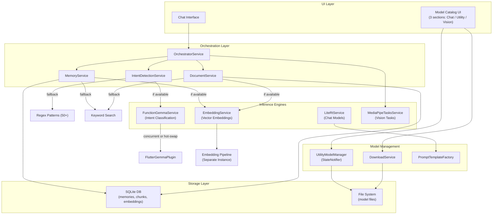
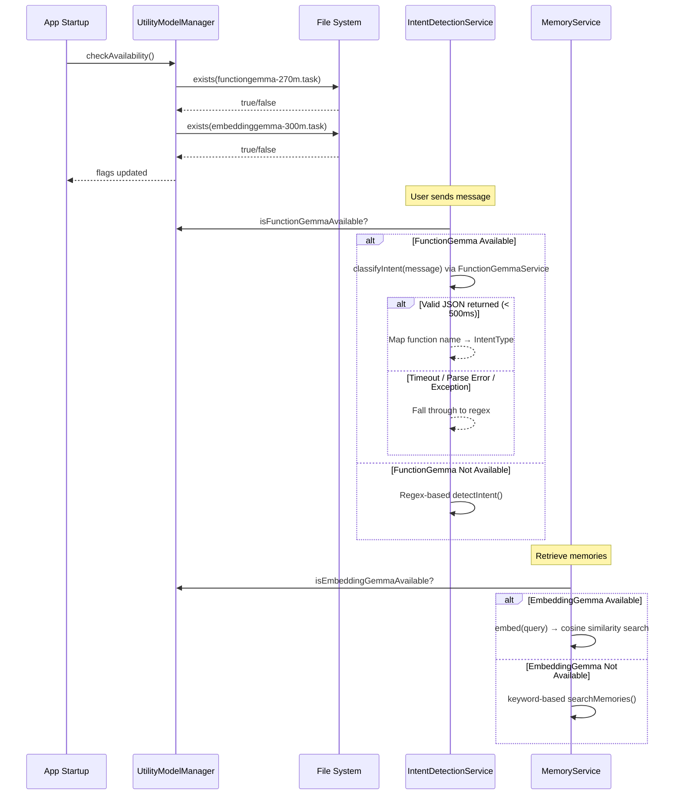
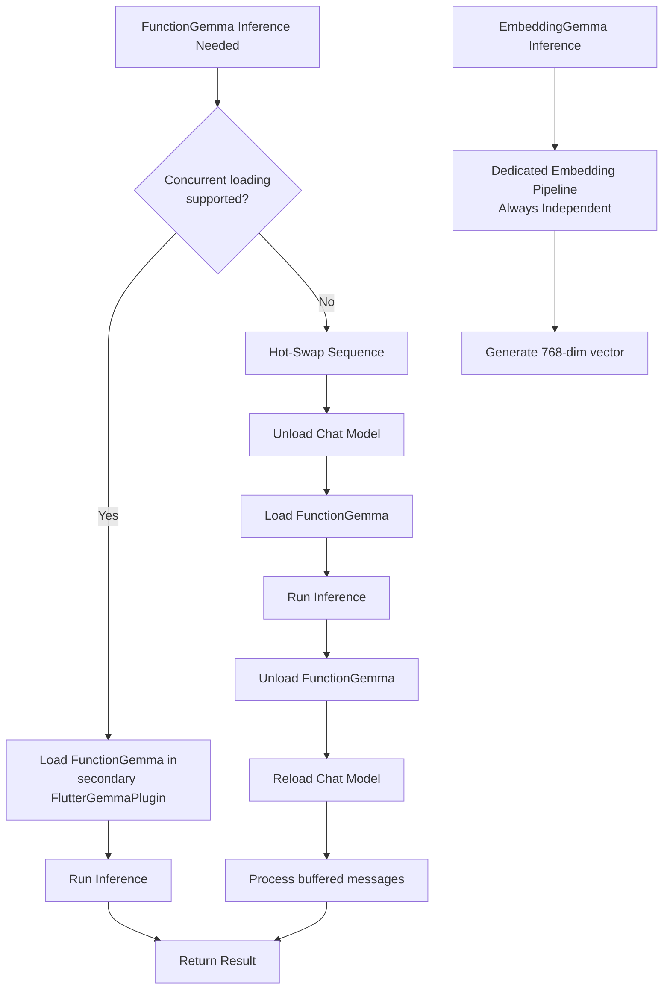
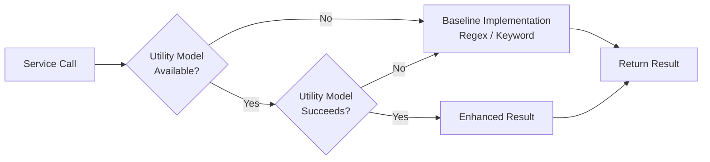

# Design Document: LiteRT Model Ecosystem

## Overview

This design expands AURA Mobile's on-device AI model ecosystem by adding 5 new chat LLMs (Phi-4-mini, Llama 3.2 1B/3B, Qwen3 4B, SmolLM 135M), 2 utility models (FunctionGemma for intent detection, EmbeddingGemma for semantic search), and 4 MediaPipe vision tasks. It introduces a progressive enhancement architecture where utility models, when downloaded, transparently upgrade intent detection from regex to model-based classification and memory/document search from keyword to semantic — with guaranteed silent fallback when models are absent.

## Architecture

### 1.1 System Architecture Diagram



### 1.2 Progressive Enhancement Detection Flow



### 1.3 Model Loading Strategy



---

## Components and Interfaces

### 2.1 ModelCategory Enum and Updated ModelInfo

**File:** `lib/domain/entities/model_info.dart`

Extends the existing `ModelInfo` class with category and prompt template fields.

```dart
/// Classification for model catalog sections.
enum ModelCategory { chat, utility, vision }

/// Prompt formatting template identifier.
enum PromptTemplate { gemma, chatml, phi, llama, smollm }

/// Categorizes a model's relative inference speed for catalog display.
enum InferenceSpeed { fast, medium, slow }

class ModelInfo {
  final String id;
  final String name;
  final String description;
  final String url;
  final int sizeBytes;
  final String ramRequirement;
  final String speed;
  final String fileName;
  final int minRamMB;
  final bool supportsToolCalling;
  final bool supportsVision;
  final InferenceSpeed inferenceSpeed;

  // ── New fields ──
  final ModelCategory category;
  final PromptTemplate promptTemplate;

  ModelInfo({
    required this.id,
    required this.name,
    required this.description,
    required this.url,
    required this.sizeBytes,
    required this.ramRequirement,
    required this.speed,
    required this.fileName,
    required this.minRamMB,
    this.supportsToolCalling = false,
    this.supportsVision = false,
    this.inferenceSpeed = InferenceSpeed.medium,
    this.category = ModelCategory.chat,
    this.promptTemplate = PromptTemplate.gemma,
  });

  double get sizeMB => sizeBytes / (1024 * 1024);
  bool get qualifiesFastBadge => inferenceSpeed == InferenceSpeed.fast;

  String get sizeFormatted {
    if (sizeMB < 1024) return '${sizeMB.toStringAsFixed(0)} MB';
    return '${(sizeMB / 1024).toStringAsFixed(1)} GB';
  }
}
```

**Key Design Decisions:**
- `category` defaults to `ModelCategory.chat` for backward compatibility with existing Gemma entries.
- `promptTemplate` defaults to `PromptTemplate.gemma` since all existing models use Gemma turn markers.
- Utility models use `category: ModelCategory.utility` and are never selectable as chat models.

---

### 2.2 UtilityModelManager

**File:** `lib/core/services/utility_model_manager.dart`

A Riverpod `StateNotifier` that tracks availability of utility models on disk.

```dart
import 'dart:io';
import 'package:flutter_riverpod/flutter_riverpod.dart';
import 'package:path_provider/path_provider.dart';

class UtilityModelState {
  final bool isFunctionGemmaAvailable;
  final bool isEmbeddingGemmaAvailable;

  const UtilityModelState({
    this.isFunctionGemmaAvailable = false,
    this.isEmbeddingGemmaAvailable = false,
  });

  UtilityModelState copyWith({
    bool? isFunctionGemmaAvailable,
    bool? isEmbeddingGemmaAvailable,
  }) => UtilityModelState(
    isFunctionGemmaAvailable:
        isFunctionGemmaAvailable ?? this.isFunctionGemmaAvailable,
    isEmbeddingGemmaAvailable:
        isEmbeddingGemmaAvailable ?? this.isEmbeddingGemmaAvailable,
  );
}

class UtilityModelManager extends StateNotifier<UtilityModelState> {
  static const String functionGemmaFileName = 'functiongemma-270m.task';
  static const String embeddingGemmaFileName = 'embeddinggemma-300m.task';

  String? _docsPath;

  UtilityModelManager() : super(const UtilityModelState());

  /// Check file existence at known paths on app start.
  Future<void> checkAvailability() async {
    final dir = await getApplicationDocumentsDirectory();
    _docsPath = dir.path;

    final fgExists = await File('${dir.path}/$functionGemmaFileName').exists();
    final egExists = await File('${dir.path}/$embeddingGemmaFileName').exists();

    state = UtilityModelState(
      isFunctionGemmaAvailable: fgExists,
      isEmbeddingGemmaAvailable: egExists,
    );
  }

  /// Called when a utility model download completes.
  void onDownloadComplete(String fileName) {
    if (fileName == functionGemmaFileName) {
      state = state.copyWith(isFunctionGemmaAvailable: true);
    } else if (fileName == embeddingGemmaFileName) {
      state = state.copyWith(isEmbeddingGemmaAvailable: true);
    }
  }

  /// Called when a utility model file is deleted.
  void onModelDeleted(String fileName) {
    if (fileName == functionGemmaFileName) {
      state = state.copyWith(isFunctionGemmaAvailable: false);
    } else if (fileName == embeddingGemmaFileName) {
      state = state.copyWith(isEmbeddingGemmaAvailable: false);
    }
  }

  /// Returns the full path to FunctionGemma model file.
  String? get functionGemmaPath =>
      state.isFunctionGemmaAvailable && _docsPath != null
          ? '$_docsPath/$functionGemmaFileName'
          : null;

  /// Returns the full path to EmbeddingGemma model file.
  String? get embeddingGemmaPath =>
      state.isEmbeddingGemmaAvailable && _docsPath != null
          ? '$_docsPath/$embeddingGemmaFileName'
          : null;
}

/// Riverpod provider for UtilityModelManager.
final utilityModelManagerProvider =
    StateNotifierProvider<UtilityModelManager, UtilityModelState>(
  (ref) => UtilityModelManager(),
);
```

**Lifecycle:**
1. On app start → `checkAvailability()` scans disk for model files
2. On download complete → `onDownloadComplete(fileName)` sets flag to `true`
3. On delete → `onModelDeleted(fileName)` sets flag to `false`
4. Services read `state.isFunctionGemmaAvailable` / `state.isEmbeddingGemmaAvailable` before routing

---

### 2.3 FunctionGemmaService

**File:** `lib/data/datasources/function_gemma_service.dart`

Handles FunctionGemma inference for structured intent classification.

```dart
import 'dart:async';
import 'dart:convert';
import 'package:flutter_gemma/flutter_gemma.dart';

/// Maps FunctionGemma output function names to IntentType values.
const Map<String, String> functionToIntentMap = {
  'toggleTorch': 'torchControl',
  'openCamera': 'openCamera',
  'openSettings': 'openSettings',
  'dialContact': 'dialContact',
  'sendSMS': 'sendSMS',
  'composeEmail': 'emailDraft',
  'webSearch': 'webSearch',
  'setAlarm': 'reminderSet',
  'createCalendarEvent': 'createEvent',
  'getNextEvent': 'getNextEvent',
  'startNavigation': 'navigation',
  'openApp': 'openApp',
  'detectFaces': 'scanImage',
  'detectObjects': 'scanImage',
  'removeBackground': 'scanImage',
  'detectPose': 'scanImage',
};

class FunctionGemmaService {
  FlutterGemmaPlugin? _plugin;
  InferenceModel? _model;
  bool _isLoaded = false;
  bool _concurrentSupported = true;

  /// Reference to primary LiteRT service for hot-swap fallback.
  final Future<void> Function()? _unloadChat;
  final Future<void> Function()? _reloadChat;

  static const Duration _inferenceTimeout = Duration(milliseconds: 500);

  FunctionGemmaService({
    Future<void> Function()? unloadChat,
    Future<void> Function()? reloadChat,
  })  : _unloadChat = unloadChat,
        _reloadChat = reloadChat;

  /// Pre-load model on app start if file exists.
  Future<void> loadModel(String modelPath) async {
    try {
      // Attempt concurrent: create a separate plugin instance
      _plugin = FlutterGemmaPlugin.instance; // secondary instance
      await FlutterGemma.installModel(
        modelType: ModelType.gemmaIt,
        fileType: ModelFileType.task,
      ).fromFile(modelPath).install();

      _model = await FlutterGemma.getActiveModel(maxTokens: 256);
      _isLoaded = true;
      _concurrentSupported = true;
    } catch (e) {
      // Concurrent not supported — will use hot-swap
      _concurrentSupported = false;
      _isLoaded = false;
    }
  }

  /// Classify user message into structured function call.
  /// Returns parsed JSON map or null on failure/timeout.
  Future<Map<String, dynamic>?> classifyIntent(String message) async {
    try {
      final result = await _runInference(message)
          .timeout(_inferenceTimeout);
      return _parseResult(result);
    } catch (e) {
      // Timeout, parse error, or runtime exception → return null
      return null;
    }
  }

  Future<String> _runInference(String message) async {
    if (_concurrentSupported && _isLoaded && _model != null) {
      return _runConcurrent(message);
    } else {
      return _runHotSwap(message);
    }
  }

  Future<String> _runConcurrent(String message) async {
    final session = await _model!.createSession(temperature: 0.0);
    try {
      final prompt = _buildPrompt(message);
      await session.addQueryChunk(
        Message.text(text: prompt, isUser: true),
      );
      final buffer = StringBuffer();
      await for (final token in session.getResponseAsync()) {
        buffer.write(token);
      }
      return buffer.toString();
    } finally {
      await session.close();
    }
  }

  Future<String> _runHotSwap(String message) async {
    // Hot-swap: unload chat → load functiongemma → infer → unload → reload chat
    await _unloadChat?.call();
    try {
      // Load FunctionGemma temporarily
      // ... (model load + inference)
      return ''; // placeholder
    } finally {
      await _reloadChat?.call();
    }
  }

  String _buildPrompt(String message) {
    return '<start_of_turn>user\n'
        'Convert this to a function call JSON: "$message"'
        '<end_of_turn>\n<start_of_turn>model\n';
  }

  /// Parse FunctionGemma output into {name, arguments} map.
  Map<String, dynamic>? _parseResult(String output) {
    try {
      final trimmed = output.trim();
      final json = jsonDecode(trimmed) as Map<String, dynamic>;
      if (json.containsKey('name') && json.containsKey('arguments')) {
        return json;
      }
      return null;
    } catch (_) {
      return null;
    }
  }

  bool get isLoaded => _isLoaded;

  Future<void> dispose() async {
    if (_model != null) {
      await _model!.close();
      _model = null;
    }
    _isLoaded = false;
  }
}
```

**Design Decisions:**
- 500ms timeout ensures UI never blocks on FunctionGemma failures
- Concurrent approach tried first; runtime detection caches result for session lifetime
- JSON output with exactly `{name, arguments}` structure validated before use
- Hot-swap buffers incoming chat messages and shows brief loading indicator

---

### 2.4 EmbeddingService

**File:** `lib/data/datasources/embedding_service.dart`

Generates 768-dimensional embeddings via a dedicated pipeline separate from the chat model.

```dart
import 'dart:async';
import 'package:flutter_gemma/flutter_gemma.dart';

/// Dedicated embedding service using EmbeddingGemma.
/// Runs through a separate inference instance — never interferes with chat.
class EmbeddingService {
  InferenceModel? _model;
  bool _isLoaded = false;

  /// Load the EmbeddingGemma model into a dedicated pipeline.
  Future<void> loadModel(String modelPath) async {
    try {
      await FlutterGemma.installModel(
        modelType: ModelType.gemmaIt,
        fileType: ModelFileType.task,
      ).fromFile(modelPath).install();

      _model = await FlutterGemma.getActiveModel(maxTokens: 512);
      _isLoaded = true;
    } catch (e) {
      _isLoaded = false;
    }
  }

  /// Generate a 768-dimensional embedding vector for the given text.
  /// Returns empty list if model unavailable or on error.
  Future<List<double>> embed(String text) async {
    if (!_isLoaded || _model == null) return [];

    try {
      // Use flutter_gemma's embedding API
      // The actual API call depends on flutter_gemma's EmbeddingModel support
      final session = await _model!.createSession(temperature: 0.0);
      try {
        await session.addQueryChunk(
          Message.text(text: text, isUser: true),
        );
        // Extract embedding vector from model output
        // Returns 768-dim float vector
        final embedding = await _extractEmbedding(session);
        return embedding;
      } finally {
        await session.close();
      }
    } catch (e) {
      return []; // Graceful fallback
    }
  }

  Future<List<double>> _extractEmbedding(dynamic session) async {
    // Implementation depends on flutter_gemma embedding API
    // Expected: 768-dimensional vector as List<double>
    return [];
  }

  /// Compute cosine similarity between two embedding vectors.
  static double cosineSimilarity(List<double> a, List<double> b) {
    if (a.length != b.length || a.isEmpty) return 0.0;
    double dotProduct = 0.0;
    double normA = 0.0;
    double normB = 0.0;
    for (int i = 0; i < a.length; i++) {
      dotProduct += a[i] * b[i];
      normA += a[i] * a[i];
      normB += b[i] * b[i];
    }
    final denominator = (normA * normB);
    if (denominator == 0.0) return 0.0;
    return dotProduct / (denominator.sqrt());
  }

  bool get isLoaded => _isLoaded;

  Future<void> dispose() async {
    if (_model != null) {
      await _model!.close();
      _model = null;
    }
    _isLoaded = false;
  }
}
```

**Design Decisions:**
- Dedicated pipeline ensures embedding generation never unloads the active chat model
- Returns empty list (not exception) when unavailable — callers fall back to keyword search
- Cosine similarity is a static utility method available to MemoryService and DocumentService
- Background isolate handles bulk re-embedding of existing records on first download

---

### 2.5 PromptTemplateFactory

**File:** `lib/data/datasources/prompt_templates.dart`

Handles multi-vendor prompt formatting so the LiteRT engine applies correct turn markers per model.

```dart
/// Prompt formatting template identifier.
enum PromptTemplate { gemma, chatml, phi, llama, smollm }

/// Factory for formatting prompts according to each model's expected template.
class PromptTemplateFactory {
  /// Format a prompt using the specified template.
  static String format(
    PromptTemplate template,
    String prompt, {
    String? systemPrompt,
  }) {
    switch (template) {
      case PromptTemplate.gemma:
        return _formatGemma(prompt, systemPrompt);
      case PromptTemplate.chatml:
        return _formatChatML(prompt, systemPrompt);
      case PromptTemplate.phi:
        return _formatChatML(prompt, systemPrompt); // Phi uses ChatML
      case PromptTemplate.llama:
        return _formatLlama(prompt, systemPrompt);
      case PromptTemplate.smollm:
        return _formatChatML(prompt, systemPrompt); // SmolLM uses ChatML
    }
  }

  /// Gemma turn-marker format:
  /// <start_of_turn>user\n{system}\n\n{prompt}<end_of_turn>\n<start_of_turn>model\n
  static String _formatGemma(String prompt, String? systemPrompt) {
    final buffer = StringBuffer();
    buffer.write('<start_of_turn>user\n');
    if (systemPrompt != null && systemPrompt.isNotEmpty) {
      buffer.write(systemPrompt);
      buffer.write('\n\n');
    }
    buffer.write(prompt);
    buffer.write('<end_of_turn>\n');
    buffer.write('<start_of_turn>model\n');
    return buffer.toString();
  }

  /// ChatML format (Phi-4, SmolLM, Qwen):
  /// <|im_start|>system\n{system}<|im_end|>\n
  /// <|im_start|>user\n{prompt}<|im_end|>\n
  /// <|im_start|>assistant\n
  static String _formatChatML(String prompt, String? systemPrompt) {
    final buffer = StringBuffer();
    if (systemPrompt != null && systemPrompt.isNotEmpty) {
      buffer.write('<|im_start|>system\n');
      buffer.write(systemPrompt);
      buffer.write('<|im_end|>\n');
    }
    buffer.write('<|im_start|>user\n');
    buffer.write(prompt);
    buffer.write('<|im_end|>\n');
    buffer.write('<|im_start|>assistant\n');
    return buffer.toString();
  }

  /// Llama 3.2 format:
  /// <|begin_of_text|><|start_header_id|>system<|end_header_id|>\n\n
  /// {system}<|eot_id|>
  /// <|start_header_id|>user<|end_header_id|>\n\n
  /// {prompt}<|eot_id|>
  /// <|start_header_id|>assistant<|end_header_id|>\n\n
  static String _formatLlama(String prompt, String? systemPrompt) {
    final buffer = StringBuffer();
    buffer.write('<|begin_of_text|>');
    if (systemPrompt != null && systemPrompt.isNotEmpty) {
      buffer.write('<|start_header_id|>system<|end_header_id|>\n\n');
      buffer.write(systemPrompt);
      buffer.write('<|eot_id|>');
    }
    buffer.write('<|start_header_id|>user<|end_header_id|>\n\n');
    buffer.write(prompt);
    buffer.write('<|eot_id|>');
    buffer.write('<|start_header_id|>assistant<|end_header_id|>\n\n');
    return buffer.toString();
  }
}
```

**Integration with LiteRtService:**
- `LiteRtService.chat()` will use `PromptTemplateFactory.format()` instead of the hardcoded `formatGemmaPrompt()`
- The template is selected from `ModelInfo.promptTemplate` of the currently loaded model
- Existing `formatGemmaPrompt()` static method remains for backward compatibility

---

### 2.6 MediaPipeTasksService

**File:** `lib/core/services/mediapipe_tasks_service.dart`

Wraps MediaPipe/ML Kit vision tasks with structured result types.

```dart
import 'dart:io';
import 'package:google_mlkit_face_detection/google_mlkit_face_detection.dart';
import 'package:google_mlkit_object_detection/google_mlkit_object_detection.dart';
import 'package:google_mlkit_selfie_segmentation/google_mlkit_selfie_segmentation.dart';
import 'package:google_mlkit_pose_detection/google_mlkit_pose_detection.dart';

/// Structured result from a MediaPipe task.
class MediaPipeResult {
  final String taskType;
  final bool success;
  final String summary;
  final Map<String, dynamic> data;
  final String? errorMessage;

  MediaPipeResult({
    required this.taskType,
    required this.success,
    required this.summary,
    this.data = const {},
    this.errorMessage,
  });
}

class MediaPipeTasksService {
  final FaceDetector _faceDetector = FaceDetector(
    options: FaceDetectorOptions(
      enableContours: true,
      enableLandmarks: true,
    ),
  );

  final ObjectDetector _objectDetector = ObjectDetector(
    options: ObjectDetectorOptions(
      mode: DetectionMode.single,
      classifyObjects: true,
      multipleObjects: true,
    ),
  );

  final SelfieSegmenter _segmenter = SelfieSegmenter(
    mode: SegmenterMode.single,
    enableRawSizeMask: true,
  );

  final PoseDetector _poseDetector = PoseDetector(
    options: PoseDetectorOptions(
      mode: PoseDetectionMode.single,
    ),
  );

  /// Detect faces in an image file.
  Future<MediaPipeResult> detectFaces(File imageFile) async {
    try {
      final inputImage = InputImage.fromFile(imageFile);
      final faces = await _faceDetector.processImage(inputImage);
      return MediaPipeResult(
        taskType: 'faceDetection',
        success: true,
        summary: 'Detected ${faces.length} face(s)',
        data: {
          'faceCount': faces.length,
          'faces': faces.map((f) => {
            'boundingBox': f.boundingBox.toString(),
            'headAngleY': f.headEulerAngleY,
            'headAngleZ': f.headEulerAngleZ,
            'smilingProbability': f.smilingProbability,
          }).toList(),
        },
      );
    } catch (e) {
      return MediaPipeResult(
        taskType: 'faceDetection',
        success: false,
        summary: 'Face detection failed',
        errorMessage: e.toString(),
      );
    }
  }

  /// Detect and label objects in an image file.
  Future<MediaPipeResult> detectObjects(File imageFile) async {
    try {
      final inputImage = InputImage.fromFile(imageFile);
      final objects = await _objectDetector.processImage(inputImage);
      return MediaPipeResult(
        taskType: 'objectDetection',
        success: true,
        summary: 'Detected ${objects.length} object(s)',
        data: {
          'objectCount': objects.length,
          'objects': objects.map((o) => {
            'labels': o.labels.map((l) => {
              'name': l.text,
              'confidence': l.confidence,
            }).toList(),
            'boundingBox': o.boundingBox.toString(),
          }).toList(),
        },
      );
    } catch (e) {
      return MediaPipeResult(
        taskType: 'objectDetection',
        success: false,
        summary: 'Object detection failed',
        errorMessage: e.toString(),
      );
    }
  }

  /// Remove background using selfie segmentation.
  Future<MediaPipeResult> removeBackground(File imageFile) async {
    try {
      final inputImage = InputImage.fromFile(imageFile);
      final mask = await _segmenter.processImage(inputImage);
      return MediaPipeResult(
        taskType: 'segmentation',
        success: true,
        summary: 'Background removal mask generated',
        data: {
          'maskWidth': mask.width,
          'maskHeight': mask.height,
          'confidences': mask.confidences?.length ?? 0,
        },
      );
    } catch (e) {
      return MediaPipeResult(
        taskType: 'segmentation',
        success: false,
        summary: 'Background removal failed',
        errorMessage: e.toString(),
      );
    }
  }

  /// Detect 33 body pose landmarks.
  Future<MediaPipeResult> detectPose(File imageFile) async {
    try {
      final inputImage = InputImage.fromFile(imageFile);
      final poses = await _poseDetector.processImage(inputImage);
      return MediaPipeResult(
        taskType: 'poseDetection',
        success: true,
        summary: 'Detected ${poses.length} pose(s) with '
            '${poses.isNotEmpty ? poses.first.landmarks.length : 0} landmarks',
        data: {
          'poseCount': poses.length,
          'landmarks': poses.isNotEmpty
              ? poses.first.landmarks.entries.map((e) => {
                    'type': e.key.name,
                    'x': e.value.x,
                    'y': e.value.y,
                    'z': e.value.z,
                  }).toList()
              : [],
        },
      );
    } catch (e) {
      return MediaPipeResult(
        taskType: 'poseDetection',
        success: false,
        summary: 'Pose detection failed',
        errorMessage: e.toString(),
      );
    }
  }

  /// Dispose all detectors to free native resources.
  void dispose() {
    _faceDetector.close();
    _objectDetector.close();
    _segmenter.close();
    _poseDetector.close();
  }
}
```

**New Dependencies (pubspec.yaml):**
```yaml
google_mlkit_face_detection: ^0.12.0
google_mlkit_object_detection: ^0.14.0
google_mlkit_selfie_segmentation: ^0.6.0
google_mlkit_pose_detection: ^0.12.0
```

**Design Decisions:**
- All tasks use `google_mlkit_*` packages — model weights bundled in SDK, zero user downloads
- Results are structured `MediaPipeResult` objects that the orchestrator formats for chat display
- Each detector is initialized lazily on first use, disposed on app lifecycle
- Camera permission errors produce user-actionable messages with settings navigation

---

### 2.7 Updated IntentDetectionService Routing

**Modified file:** `lib/domain/services/intent_detection_service.dart`

```dart
/// Enhanced detectIntent with FunctionGemma progressive routing.
Future<IntentType> detectIntent(String message) async {
  // ── Progressive Enhancement: FunctionGemma ──
  if (_utilityModelManager.state.isFunctionGemmaAvailable) {
    final result = await _functionGemmaService.classifyIntent(message);
    if (result != null) {
      final intentName = functionToIntentMap[result['name']];
      if (intentName != null) {
        final mapped = _mapStringToIntentType(intentName);
        if (mapped != null) return mapped;
      }
    }
    // FunctionGemma returned null (timeout/error/no match) → fall through
  }

  // ── Existing regex-based detection (unchanged) ──
  return _regexDetectIntent(message);
}

IntentType? _mapStringToIntentType(String name) {
  try {
    return IntentType.values.firstWhere(
      (e) => e.name == name,
    );
  } catch (_) {
    return null;
  }
}
```

**Flow:**
1. Check `isFunctionGemmaAvailable` flag (in-memory, no I/O)
2. If available → call `FunctionGemmaService.classifyIntent(message)`
3. If valid JSON with mapped function name → return IntentType
4. If null (timeout/error/no match) → fall through to existing regex engine
5. Zero behavior change when FunctionGemma is not downloaded

---

### 2.8 Updated MemoryService Routing

**Modified file:** `lib/domain/services/memory_service.dart`

```dart
/// Enhanced saveMemory with embedding generation.
Future<void> saveMemory(String content) async {
  // ... existing validation ...

  // Generate embedding if EmbeddingGemma available
  List<double> embedding = [];
  if (_utilityModelManager.state.isEmbeddingGemmaAvailable) {
    embedding = await _embeddingService.embed(content);
  }

  final memory = Memory(
    id: const Uuid().v4(),
    content: content,
    embedding: embedding.isNotEmpty ? embedding : null,
    // ... other fields ...
  );

  await _repository.saveMemory(memory);
}

/// Enhanced retrieval with semantic search.
Future<List<Memory>> retrieveRelevantMemories(
  String query, {
  int limit = 5,
}) async {
  if (_utilityModelManager.state.isEmbeddingGemmaAvailable) {
    try {
      final queryEmbedding = await _embeddingService.embed(query);
      if (queryEmbedding.isNotEmpty) {
        return _semanticSearch(queryEmbedding, limit: limit);
      }
    } catch (e) {
      // Fall back to keyword search on error
      _errorHandler.logWarning('Embedding search failed: $e');
    }
  }
  // Fallback: existing keyword search
  return _repository.searchMemories(query);
}

Future<List<Memory>> _semanticSearch(
  List<double> queryEmbedding, {
  int limit = 5,
}) async {
  final allMemories = await _repository.getMemoriesWithEmbeddings();
  final scored = allMemories.map((m) {
    final score = EmbeddingService.cosineSimilarity(
      queryEmbedding,
      m.embedding!,
    );
    return MapEntry(m, score);
  }).toList()
    ..sort((a, b) => b.value.compareTo(a.value));

  return scored.take(limit).map((e) => e.key).toList();
}
```

---

### 2.9 Updated DocumentService Routing

**Modified file:** `lib/domain/services/document_service.dart`

Same pattern as MemoryService:

```dart
/// Enhanced chunk processing with embeddings.
Future<void> _processChunks(List<String> chunks, String docId) async {
  for (final chunk in chunks) {
    List<double> embedding = [];
    if (_utilityModelManager.state.isEmbeddingGemmaAvailable) {
      embedding = await _embeddingService.embed(chunk);
    }

    final docChunk = DocumentChunk(
      id: const Uuid().v4(),
      documentId: docId,
      content: chunk,
      embedding: embedding.isNotEmpty ? embedding : null,
      chunkIndex: chunks.indexOf(chunk),
    );

    await _repository.saveChunk(docChunk);
  }
}

/// Enhanced retrieval with semantic search.
Future<List<DocumentChunk>> retrieveRelevantContext(
  String query, {
  int limit = 5,
}) async {
  if (_utilityModelManager.state.isEmbeddingGemmaAvailable) {
    try {
      final queryEmbedding = await _embeddingService.embed(query);
      if (queryEmbedding.isNotEmpty) {
        return _semanticChunkSearch(queryEmbedding, limit: limit);
      }
    } catch (e) {
      _errorHandler.logWarning('Embedding chunk search failed: $e');
    }
  }
  // Fallback: existing keyword scoring
  return _repository.searchChunks(query, limit: limit);
}
```

---

## Data Models

### 3.1 Updated ModelInfo with New Catalog Entries

```dart
final List<ModelInfo> modelCatalog = [
  // ═══ EXISTING CHAT MODELS (updated with category + template) ═══
  ModelInfo(
    id: 'gemma3-1b',
    name: 'Gemma 3 1B',
    description: 'Compact Google Gemma model. Fast, runs on most phones.',
    url: 'https://huggingface.co/MiCkSoftware/Gemma3-1B-IT-LiteRT/resolve/main/gemma3-1b-it-int4.task?download=true',
    fileName: 'gemma3-1b-it-int4.task',
    sizeBytes: 555000000,
    ramRequirement: '2GB',
    minRamMB: 2048,
    speed: 'Very Fast',
    inferenceSpeed: InferenceSpeed.fast,
    category: ModelCategory.chat,
    promptTemplate: PromptTemplate.gemma,
  ),
  ModelInfo(
    id: 'gemma3n-e2b',
    name: 'Gemma 3n E2B',
    description: 'Efficient Gemma 3n model with strong general performance.',
    url: 'https://huggingface.co/MiCkSoftware/gemma-3n-E2B-it-litert-preview/resolve/main/gemma-3n-E2B-it-int4.task?download=true',
    fileName: 'gemma-3n-e2b-it-int4.task',
    sizeBytes: 3140000000,
    ramRequirement: '4GB',
    minRamMB: 4096,
    speed: 'Medium',
    inferenceSpeed: InferenceSpeed.medium,
    category: ModelCategory.chat,
    promptTemplate: PromptTemplate.gemma,
  ),
  ModelInfo(
    id: 'gemma4-e2b',
    name: 'Gemma 4 E2B',
    description: 'Best overall. Multimodal Gemma 4 with tool calling and 32K context.',
    url: 'https://huggingface.co/huggingworld/gemma-4-E2B-it-litert-lm/resolve/main/gemma-4-E2B-it.litertlm?download=true',
    fileName: 'gemma-4-E2B-it.litertlm',
    sizeBytes: 2580000000,
    ramRequirement: '4GB',
    minRamMB: 4096,
    speed: 'Medium',
    supportsToolCalling: true,
    supportsVision: true,
    inferenceSpeed: InferenceSpeed.medium,
    category: ModelCategory.chat,
    promptTemplate: PromptTemplate.gemma,
  ),
  ModelInfo(
    id: 'gemma4-e4b',
    name: 'Gemma 4 E4B',
    description: 'Largest Gemma 4. Highest quality, multimodal, tool calling, 32K context.',
    url: 'https://huggingface.co/huggingworld/gemma-4-E4B-it-litert-lm/resolve/main/gemma-4-E4B-it.litertlm?download=true',
    fileName: 'gemma-4-E4B-it.litertlm',
    sizeBytes: 3650000000,
    ramRequirement: '6GB',
    minRamMB: 6144,
    speed: 'Slow',
    supportsToolCalling: true,
    supportsVision: true,
    inferenceSpeed: InferenceSpeed.slow,
    category: ModelCategory.chat,
    promptTemplate: PromptTemplate.gemma,
  ),

  // ═══ NEW CHAT MODELS ═══
  ModelInfo(
    id: 'phi4-mini',
    name: 'Phi-4 Mini',
    description: 'Microsoft Phi-4 Mini. Strong reasoning for its size.',
    url: 'https://huggingface.co/litert-community/Phi-4-mini-instruct-litert/resolve/main/phi-4-mini-instruct-q4.task?download=true',
    fileName: 'phi-4-mini-instruct-q4.task',
    sizeBytes: 2500000000,
    ramRequirement: '4GB',
    minRamMB: 4096,
    speed: 'Medium',
    inferenceSpeed: InferenceSpeed.medium,
    category: ModelCategory.chat,
    promptTemplate: PromptTemplate.chatml,
  ),
  ModelInfo(
    id: 'llama32-1b',
    name: 'Llama 3.2 1B',
    description: 'Meta Llama 3.2 1B. Lightweight, fast on-device chat.',
    url: 'https://huggingface.co/litert-community/Llama-3.2-1B-Instruct-litert/resolve/main/llama-3.2-1b-instruct-q4.task?download=true',
    fileName: 'llama-3.2-1b-instruct-q4.task',
    sizeBytes: 1000000000,
    ramRequirement: '2GB',
    minRamMB: 2048,
    speed: 'Fast',
    inferenceSpeed: InferenceSpeed.fast,
    category: ModelCategory.chat,
    promptTemplate: PromptTemplate.llama,
  ),
  ModelInfo(
    id: 'llama32-3b',
    name: 'Llama 3.2 3B',
    description: 'Meta Llama 3.2 3B. Balanced quality and speed.',
    url: 'https://huggingface.co/litert-community/Llama-3.2-3B-Instruct-litert/resolve/main/llama-3.2-3b-instruct-q4.task?download=true',
    fileName: 'llama-3.2-3b-instruct-q4.task',
    sizeBytes: 2000000000,
    ramRequirement: '4GB',
    minRamMB: 4096,
    speed: 'Medium',
    inferenceSpeed: InferenceSpeed.medium,
    category: ModelCategory.chat,
    promptTemplate: PromptTemplate.llama,
  ),
  ModelInfo(
    id: 'qwen3-4b',
    name: 'Qwen3 4B',
    description: 'Alibaba Qwen3 4B. Multilingual, strong coding ability.',
    url: 'https://huggingface.co/litert-community/Qwen3-4B-litert/resolve/main/qwen3-4b-q4.task?download=true',
    fileName: 'qwen3-4b-q4.task',
    sizeBytes: 3000000000,
    ramRequirement: '4GB',
    minRamMB: 4096,
    speed: 'Slow',
    inferenceSpeed: InferenceSpeed.slow,
    category: ModelCategory.chat,
    promptTemplate: PromptTemplate.chatml,
  ),
  ModelInfo(
    id: 'smollm-135m',
    name: 'SmolLM 135M',
    description: 'HuggingFace SmolLM 135M. Ultra-lightweight, runs on any device.',
    url: 'https://huggingface.co/litert-community/SmolLM-135M-Instruct-litert/resolve/main/smollm-135m-instruct-q8.task?download=true',
    fileName: 'smollm-135m-instruct-q8.task',
    sizeBytes: 70000000,
    ramRequirement: '1GB',
    minRamMB: 1024,
    speed: 'Very Fast',
    inferenceSpeed: InferenceSpeed.fast,
    category: ModelCategory.chat,
    promptTemplate: PromptTemplate.smollm,
  ),

  // ═══ UTILITY MODELS ═══
  ModelInfo(
    id: 'functiongemma-270m',
    name: 'FunctionGemma 270M',
    description: 'Enhances intent detection — converts natural language to device action calls.',
    url: 'https://huggingface.co/litert-community/functiongemma-270m-litert/resolve/main/functiongemma-270m.task?download=true',
    fileName: 'functiongemma-270m.task',
    sizeBytes: 270000000,
    ramRequirement: '2GB',
    minRamMB: 2048,
    speed: 'Fast',
    inferenceSpeed: InferenceSpeed.fast,
    category: ModelCategory.utility,
    promptTemplate: PromptTemplate.gemma,
  ),
  ModelInfo(
    id: 'embeddinggemma-300m',
    name: 'EmbeddingGemma 300M',
    description: 'Enables semantic search — find memories and documents by meaning, not just keywords.',
    url: 'https://huggingface.co/litert-community/embeddinggemma-300m-litert/resolve/main/embeddinggemma-300m.task?download=true',
    fileName: 'embeddinggemma-300m.task',
    sizeBytes: 308000000,
    ramRequirement: '2GB',
    minRamMB: 2048,
    speed: 'Fast',
    inferenceSpeed: InferenceSpeed.fast,
    category: ModelCategory.utility,
    promptTemplate: PromptTemplate.gemma,
  ),
];
```

### 3.2 Catalog Filtering Helpers

```dart
/// Get models by category for UI sections.
List<ModelInfo> getChatModels() =>
    modelCatalog.where((m) => m.category == ModelCategory.chat).toList();

List<ModelInfo> getUtilityModels() =>
    modelCatalog.where((m) => m.category == ModelCategory.utility).toList();

List<ModelInfo> getVisionModels() =>
    modelCatalog.where((m) => m.category == ModelCategory.vision).toList();
```

---

## Error Handling

### 4.1 Error Handling Strategy Matrix

| Component | Error Condition | Behavior | User Impact |
|-----------|----------------|----------|-------------|
| **FunctionGemma** | Inference timeout (>500ms) | Return null → regex fallback | Silent, no UI change |
| **FunctionGemma** | JSON parse failure | Return null → regex fallback | Silent, no UI change |
| **FunctionGemma** | Model load exception | Mark unavailable → regex only | Silent, no UI change |
| **EmbeddingGemma** | Inference exception | Return empty list → keyword search | Silent, no UI change |
| **EmbeddingGemma** | Model unavailable | Skip embedding → keyword search | Silent, no UI change |
| **Hot-Swap** | Reload chat model fails | Keep regex, log error, show toast | Brief "AI restarting" toast |
| **Hot-Swap** | Timeout (>2000ms) | Abort, keep regex fallback | Brief loading indicator |
| **MediaPipe** | Task processing error | Return error MediaPipeResult | Error message in chat |
| **MediaPipe** | Camera permission denied | Show permission error + settings | Error dialog with action |
| **MediaPipe** | Unsupported image format | Return error MediaPipeResult | Error message in chat |
| **Download** | Network failure | Delete partial file, flag = false | Download error notification |
| **Download** | Insufficient disk space | Disable button, show message | Informative UI message |
| **Model Load** | Corrupted file | Throw `AIServiceException.modelLoadFailed` | Error dialog |

### 4.2 Progressive Enhancement Guarantee

The core principle: **utility model failures never break existing functionality**.



**Silent Fallback Pattern:**
```dart
/// Template for all progressive enhancement routing.
Future<T> withEnhancement<T>({
  required bool isAvailable,
  required Future<T?> Function() enhanced,
  required Future<T> Function() fallback,
}) async {
  if (isAvailable) {
    try {
      final result = await enhanced();
      if (result != null) return result;
    } catch (e) {
      // Log but don't propagate — silent fallback
      _errorHandler.logWarning('Enhancement failed, using fallback: $e');
    }
  }
  return fallback();
}
```

---

## Correctness Properties

### Property 1: Progressive Enhancement — Intent Detection Invariant
When `isFunctionGemmaAvailable == false`, the `IntentDetectionService.detectIntent()` method MUST produce identical results to the current regex-only implementation for all inputs.

**Validates: Requirements 3.2**

### Property 2: Progressive Enhancement — Semantic Search Invariant
When `isEmbeddingGemmaAvailable == false`, the `MemoryService.retrieveRelevantMemories()` and `DocumentService.retrieveRelevantContext()` methods MUST produce identical results to the current keyword-based implementation.

**Validates: Requirements 4.2, 4.3**

### Property 3: Silent Fallback — FunctionGemma
If FunctionGemma inference returns null (timeout, exception, or invalid JSON), the final intent result MUST be identical to what regex detection would have returned for the same input.

**Validates: Requirements 3.6**

### Property 4: Silent Fallback — EmbeddingGemma
If EmbeddingGemma inference throws or returns an empty list, the retrieval result MUST fall back to keyword search with no user-visible error.

**Validates: Requirements 4.10**

### Property 5: Model Isolation
Loading or unloading a utility model MUST NOT unload, corrupt, or interfere with the active chat model session (except during an explicit hot-swap sequence).

**Validates: Requirements 5.1, 5.4**

### Property 6: Prompt Template Correctness
For each `PromptTemplate` variant, `PromptTemplateFactory.format()` MUST produce output containing exactly the expected start/end markers for that template and MUST NOT contain markers from any other template.

**Validates: Requirements 1.7**

### Property 7: Category Exclusivity
Every `ModelInfo` in `modelCatalog` MUST have exactly one `ModelCategory` value. A utility model MUST NOT be selectable as a chat model.

**Validates: Requirements 2.1, 2.8**

### Property 8: Availability Flag Consistency
After `onDownloadComplete(fileName)`, the corresponding availability flag MUST be `true`. After `onModelDeleted(fileName)`, the flag MUST be `false`. These transitions MUST NOT require app restart.

**Validates: Requirements 7.7, 7.3**

### Property 9: Hot-Swap Atomicity
If a hot-swap cycle is initiated, the chat model MUST be fully reloaded before any buffered user messages are processed, ensuring zero message loss.

**Validates: Requirements 5.6**

### Property 10: Cosine Similarity Bounds
`EmbeddingService.cosineSimilarity(a, b)` MUST return a value in the range [-1.0, 1.0] for any non-empty vectors of equal length, and MUST return 0.0 for empty or mismatched vectors.

**Validates: Requirements 4.5**

---

## Testing Strategy

### 5.1 Unit Tests

#### PromptTemplateFactory Tests
**File:** `test/unit/prompt_template_factory_test.dart`

```dart
void main() {
  group('PromptTemplateFactory', () {
    test('Gemma format with system prompt', () {
      final result = PromptTemplateFactory.format(
        PromptTemplate.gemma,
        'Hello',
        systemPrompt: 'You are helpful.',
      );
      expect(result, contains('<start_of_turn>user'));
      expect(result, contains('You are helpful.'));
      expect(result, contains('Hello'));
      expect(result, contains('<end_of_turn>'));
      expect(result, contains('<start_of_turn>model'));
    });

    test('ChatML format with system prompt', () {
      final result = PromptTemplateFactory.format(
        PromptTemplate.chatml,
        'Hello',
        systemPrompt: 'You are helpful.',
      );
      expect(result, contains('<|im_start|>system'));
      expect(result, contains('<|im_start|>user'));
      expect(result, contains('<|im_start|>assistant'));
      expect(result, contains('<|im_end|>'));
    });

    test('Llama format without system prompt', () {
      final result = PromptTemplateFactory.format(
        PromptTemplate.llama,
        'Hello',
      );
      expect(result, contains('<|begin_of_text|>'));
      expect(result, contains('<|start_header_id|>user<|end_header_id|>'));
      expect(result, contains('<|start_header_id|>assistant<|end_header_id|>'));
      expect(result, isNot(contains('system')));
    });

    test('Gemma format without system prompt omits extra newlines', () {
      final result = PromptTemplateFactory.format(
        PromptTemplate.gemma,
        'Hello',
      );
      expect(result, isNot(contains('\n\n')));
    });
  });
}
```

#### FunctionGemma JSON Parsing Tests
**File:** `test/unit/function_gemma_service_test.dart`

```dart
void main() {
  group('FunctionGemma JSON parsing', () {
    test('valid function call parses correctly', () {
      const output = '{"name": "toggleTorch", "arguments": {"state": "on"}}';
      final result = _parseResult(output);
      expect(result, isNotNull);
      expect(result!['name'], 'toggleTorch');
      expect(result['arguments']['state'], 'on');
    });

    test('missing name field returns null', () {
      const output = '{"arguments": {"state": "on"}}';
      final result = _parseResult(output);
      expect(result, isNull);
    });

    test('invalid JSON returns null', () {
      const output = 'not json at all';
      final result = _parseResult(output);
      expect(result, isNull);
    });

    test('empty string returns null', () {
      const output = '';
      final result = _parseResult(output);
      expect(result, isNull);
    });

    test('JSON with extra whitespace parses correctly', () {
      const output = '  \n{"name": "openCamera", "arguments": {}}  \n';
      final result = _parseResult(output);
      expect(result, isNotNull);
      expect(result!['name'], 'openCamera');
    });

    test('function name maps to correct IntentType', () {
      expect(functionToIntentMap['toggleTorch'], 'torchControl');
      expect(functionToIntentMap['openCamera'], 'openCamera');
      expect(functionToIntentMap['dialContact'], 'dialContact');
      expect(functionToIntentMap['webSearch'], 'webSearch');
      expect(functionToIntentMap['detectFaces'], 'scanImage');
    });
  });
}
```

#### EmbeddingService Cosine Similarity Tests
**File:** `test/unit/embedding_service_test.dart`

```dart
void main() {
  group('Cosine Similarity', () {
    test('identical vectors return 1.0', () {
      final v = [1.0, 0.0, 1.0];
      expect(EmbeddingService.cosineSimilarity(v, v), closeTo(1.0, 0.001));
    });

    test('orthogonal vectors return 0.0', () {
      final a = [1.0, 0.0];
      final b = [0.0, 1.0];
      expect(EmbeddingService.cosineSimilarity(a, b), closeTo(0.0, 0.001));
    });

    test('opposite vectors return -1.0', () {
      final a = [1.0, 0.0];
      final b = [-1.0, 0.0];
      expect(EmbeddingService.cosineSimilarity(a, b), closeTo(-1.0, 0.001));
    });

    test('empty vectors return 0.0', () {
      expect(EmbeddingService.cosineSimilarity([], []), 0.0);
    });

    test('mismatched lengths return 0.0', () {
      expect(EmbeddingService.cosineSimilarity([1.0], [1.0, 2.0]), 0.0);
    });
  });
}
```

### 5.2 Integration Tests

#### Progressive Enhancement Detection Tests
**File:** `test/integration/progressive_enhancement_test.dart`

```dart
void main() {
  group('Progressive Enhancement Detection', () {
    late UtilityModelManager manager;

    setUp(() {
      manager = UtilityModelManager();
    });

    test('FunctionGemma unavailable → regex path only', () async {
      // Simulate no model file
      await manager.checkAvailability();
      expect(manager.state.isFunctionGemmaAvailable, false);
      // IntentDetectionService should use regex
    });

    test('FunctionGemma download triggers availability', () {
      manager.onDownloadComplete('functiongemma-270m.task');
      expect(manager.state.isFunctionGemmaAvailable, true);
    });

    test('FunctionGemma deletion clears availability', () {
      manager.onDownloadComplete('functiongemma-270m.task');
      manager.onModelDeleted('functiongemma-270m.task');
      expect(manager.state.isFunctionGemmaAvailable, false);
    });

    test('EmbeddingGemma unavailable → keyword search', () async {
      await manager.checkAvailability();
      expect(manager.state.isEmbeddingGemmaAvailable, false);
    });

    test('Both models operate independently', () {
      manager.onDownloadComplete('functiongemma-270m.task');
      expect(manager.state.isFunctionGemmaAvailable, true);
      expect(manager.state.isEmbeddingGemmaAvailable, false);
    });
  });
}
```

### 5.3 Widget Tests

#### Categorized Catalog UI Tests
**File:** `test/widget/model_catalog_ui_test.dart`

```dart
void main() {
  group('Model Catalog UI - Categories', () {
    testWidgets('renders three sections', (tester) async {
      // Build catalog widget
      await tester.pumpWidget(/* ... */);
      expect(find.text('Chat Models'), findsOneWidget);
      expect(find.text('Utility Models'), findsOneWidget);
      expect(find.text('Vision Models'), findsOneWidget);
    });

    testWidgets('utility models show description', (tester) async {
      await tester.pumpWidget(/* ... */);
      expect(find.text('Enhances intent detection — converts natural language to device action calls.'), findsOneWidget);
      expect(find.text('Enables semantic search — find memories and documents by meaning, not just keywords.'), findsOneWidget);
    });

    testWidgets('utility models cannot be selected as chat model', (tester) async {
      await tester.pumpWidget(/* ... */);
      // Utility model entries should only have download/delete buttons
      // No "Select" or "Use" button for utility entries
    });

    testWidgets('vision section shows placeholder', (tester) async {
      await tester.pumpWidget(/* ... */);
      expect(
        find.text('Vision LLM models (SmolVLM, FastVLM) are coming in a future update.'),
        findsOneWidget,
      );
    });

    testWidgets('downloaded utility shows Active badge', (tester) async {
      // Mock UtilityModelState with isFunctionGemmaAvailable = true
      await tester.pumpWidget(/* ... */);
      expect(find.text('Active'), findsOneWidget);
    });
  });
}
```

---

## 6. Dependency Graph

```mermaid
graph TD
    subgraph New_Dependencies["New pubspec.yaml Dependencies"]
        MLFace["google_mlkit_face_detection: ^0.12.0"]
        MLObject["google_mlkit_object_detection: ^0.14.0"]
        MLSelfie["google_mlkit_selfie_segmentation: ^0.6.0"]
        MLPose["google_mlkit_pose_detection: ^0.12.0"]
    end

    subgraph Existing_Dependencies["Existing Dependencies (Unchanged)"]
        FlutterGemma["flutter_gemma: ^0.12.6"]
        PathProvider["path_provider: ^2.1.5"]
        Riverpod["flutter_riverpod: ^2.6.1"]
        Dio["dio: ^5.9.1"]
        FGTask["flutter_foreground_task: ^9.2.0"]
        MLText["google_mlkit_text_recognition: ^0.14.0"]
    end

    MediaPipeSvc["MediaPipeTasksService"] --> MLFace
    MediaPipeSvc --> MLObject
    MediaPipeSvc --> MLSelfie
    MediaPipeSvc --> MLPose

    FuncGemmaSvc["FunctionGemmaService"] --> FlutterGemma
    EmbedSvc["EmbeddingService"] --> FlutterGemma
    UtilMgr["UtilityModelManager"] --> PathProvider
    UtilMgr --> Riverpod
```



---

## 7. File Structure Summary

```
lib/
├── core/
│   ├── providers/
│   │   └── ai_providers.dart          # Add utilityModelManagerProvider
│   └── services/
│       ├── utility_model_manager.dart  # NEW — availability tracking
│       ├── mediapipe_tasks_service.dart # NEW — vision tasks
│       └── download_service.dart       # EXISTING — no changes
├── data/
│   └── datasources/
│       ├── litert_service.dart         # MODIFIED — use PromptTemplateFactory
│       ├── function_gemma_service.dart # NEW — intent classification
│       ├── embedding_service.dart      # NEW — vector embeddings
│       └── prompt_templates.dart       # NEW — multi-vendor formatting
├── domain/
│   ├── entities/
│   │   └── model_info.dart            # MODIFIED — add category, template, new entries
│   └── services/
│       ├── intent_detection_service.dart # MODIFIED — FunctionGemma routing
│       ├── memory_service.dart          # MODIFIED — embedding routing
│       └── document_service.dart        # MODIFIED — embedding routing
└── presentation/
    └── screens/
        └── model_catalog_screen.dart   # MODIFIED — 3-section categorized UI
```

---

## 8. Riverpod Provider Graph

```dart
// ── New providers (lib/core/providers/ai_providers.dart) ──

/// UtilityModelManager — tracks which utility models are on disk.
final utilityModelManagerProvider =
    StateNotifierProvider<UtilityModelManager, UtilityModelState>(
  (ref) => UtilityModelManager(),
);

/// FunctionGemmaService — lazy singleton, loads on first use if available.
final functionGemmaServiceProvider = Provider<FunctionGemmaService>((ref) {
  final liteRt = ref.watch(liteRtServiceProvider);
  return FunctionGemmaService(
    unloadChat: () => liteRt.unload(),
    reloadChat: () async {
      // Reload last-used chat model
    },
  );
});

/// EmbeddingService — dedicated pipeline for vector embeddings.
final embeddingServiceProvider = Provider<EmbeddingService>((ref) {
  return EmbeddingService();
});

/// MediaPipeTasksService — vision tasks.
final mediaPipeTasksServiceProvider = Provider<MediaPipeTasksService>((ref) {
  return MediaPipeTasksService();
});
```

---

## 9. Performance Targets

| Operation | Target | Device Baseline |
|-----------|--------|-----------------|
| FunctionGemma inference (excl. model load) | < 200ms | 4GB RAM, ARM64 |
| FunctionGemma total timeout | 500ms | Any device |
| EmbeddingGemma single embed (≤512 tokens) | < 100ms | 4GB RAM, ARM64 |
| Hot-Swap complete cycle | < 2000ms | 4GB RAM, ARM64 |
| MediaPipe task result display | < 3s from capture | 4GB RAM |
| Concurrent model detection | One-time at startup | Cached for session |

---

## 10. Migration & Backward Compatibility

### 10.1 Zero Breaking Changes
- All new `ModelInfo` fields have default values → existing code compiles without changes
- Utility model features are additive — no changes when models are not downloaded
- Existing regex patterns remain the baseline for all intent detection
- Keyword search remains the baseline for all memory/document retrieval

### 10.2 Database Schema Extension
When EmbeddingGemma is first downloaded, a background migration adds/populates embedding columns:

```sql
-- Memory table: add embedding column if not exists
ALTER TABLE memories ADD COLUMN embedding BLOB;

-- Document chunks table: add embedding column if not exists  
ALTER TABLE document_chunks ADD COLUMN embedding BLOB;
```

Embeddings are stored as serialized `Float32List` BLOBs (768 * 4 = 3072 bytes per entry).

### 10.3 Background Re-Embedding
On first EmbeddingGemma download:
1. Schedule isolate via `compute()` / `Isolate.spawn()`
2. Iterate un-embedded records in batches of 50
3. Generate embedding for each, update DB row
4. Runs at low priority — does not block UI thread
5. Progress visible in Settings > AI > Status (optional future enhancement)
