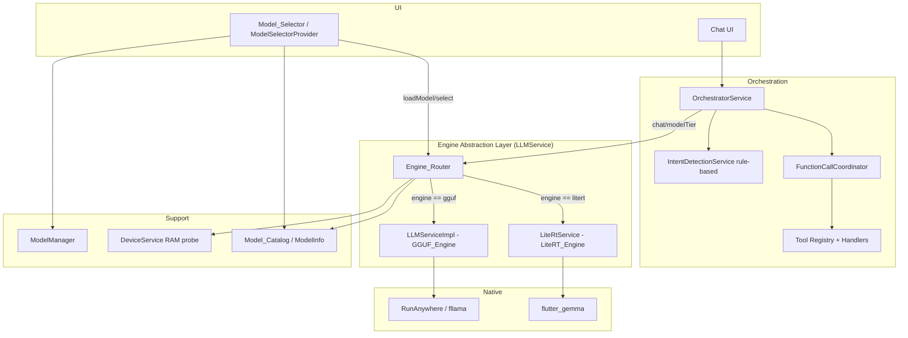
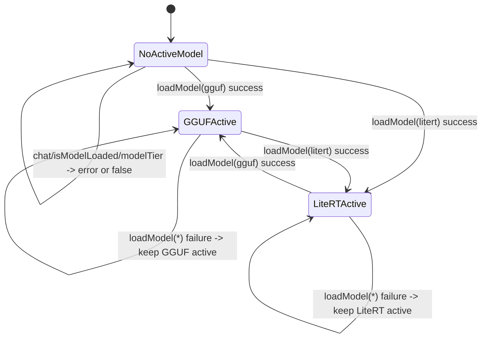

# Design Document

## Overview

This feature adds a second inference engine to AURA Mobile so the app can run Google
Gemma models in the LiteRT/MediaPipe format (`.task` / `.litertlm`) alongside the
existing GGUF (Qwen 2.5) models. The central idea is a **dual-engine architecture**:
an `Engine_Router` sits behind the existing `LLMService` interface and delegates every
call to whichever concrete engine owns the currently active model. Because the router
*is* an `LLMService`, the `OrchestratorService` and all downstream code keep calling
`initialize`, `loadModel`, `chat`, `isModelLoaded`, and `modelTier` exactly as they do
today — they never learn that a second engine exists.

The existing `RunAnywhere`/`LLMServiceImpl` GGUF path is preserved verbatim and becomes
one of the two engines the router can delegate to. A new `LiteRtService` wraps the
`flutter_gemma` package to provide the second engine. The `ModelInfo` entity gains an
`engine` field plus capability metadata (tool-calling, vision, inference speed), and the
catalog is expanded with four Gemma entries. Tool-calling-capable models (Gemma 4) use
`flutter_gemma`'s native function calling, which routes through the same orchestrator
tool handlers that rule-based intent detection uses today.

The design is deliberately conservative about device safety: model loads are gated by a
pre-flight RAM check, LiteRT model files are downloaded post-install (never bundled),
the Android build is switched to a per-ABI split, and any LiteRT initialization or chat
failure degrades gracefully without touching the GGUF path.

### Research Summary

Key findings that informed this design:

- **`flutter_gemma` package** exposes a singleton `FlutterGemmaPlugin.instance` with a
  `ModelFileManager` (for installing model files from a path/asset) and a
  `createModel(...)` factory that returns an `InferenceModel`. Inference runs through a
  session (`createSession`) or a chat instance (`createChat`), and responses are
  delivered as an async token stream (`generateChatResponseAsync`). This maps cleanly
  onto the existing `Stream<String> chat(...)` contract. The package supports
  `ModelType.gemmaIt` and exposes native function-calling for capable models via tool
  declarations passed at session/chat creation.
- **Prompt templates differ by engine.** GGUF/Qwen uses ChatML (`<|im_start|>` /
  `<|im_end|>`), already implemented in `RunAnywhere.chat`. Gemma LiteRT uses
  `<start_of_turn>user … <end_of_turn><start_of_turn>model`. `flutter_gemma` applies the
  Gemma template internally when using its chat API, but the design keeps an explicit
  formatter so behavior is verifiable and so we control system-prompt injection.
- **Native memory probing already exists.** `DeviceService` reads total/available RAM in
  MB through the `com.aura.ai/memory` `MethodChannel`. The RAM-safety requirement (Req 8)
  reuses this rather than introducing a new mechanism. A `null`/zero reading is treated
  as "could not determine RAM."
- **Split-ABI builds** are configured in `android/app/build.gradle.kts` via a `splits {
    abi { … } }` block. With per-ABI APKs, each installed package contains only its
  architecture's native `.so` files. LiteRT/MediaPipe ships native binaries per ABI, so
  the split is what keeps installed size in check.
- **Download infrastructure is engine-agnostic.** `RunAnywhere.downloadModel` dispatches
  a foreground-service download by URL + destination path and reports progress on a
  broadcast stream. `ModelSelectorNotifier` already implements 3-attempt retry and
  restart recovery. The LiteRT format reuses this pipeline; only validation (magic-byte
  check) is format-specific.

## Architecture

### Layered View



### Active-Model Delegation Model

The router holds at most one **active model**. The active model is the `ModelInfo` set by
the most recent *successful* `loadModel` call. Every `LLMService` member other than
`loadModel` is delegated to the engine of the active model; `loadModel` itself selects the
engine from the requested model's `engine` field.



The critical invariant: a `loadModel` failure (unsupported format, load error, RAM
insufficiency, or LiteRT init failure) **never** changes the active model. The router
only commits a new active model after the selected engine reports `isModelLoaded == true`.

### Load Sequence (with RAM gate and LiteRT fallback)

```mermaid
sequenceDiagram
    participant UI as Model_Selector
    participant R as Engine_Router
    participant D as DeviceService
    participant E as Selected Engine
    UI->>R: loadModel(modelInfo)
    R->>D: analyzeDevice() -> deviceRamMB
    alt RAM unknown
        R-->>UI: device-compatibility error (memory unverifiable); active model unchanged
    else minRamMB > deviceRamMB
        R-->>UI: memory-insufficiency error (required vs available); active model unchanged
    else RAM sufficient
        R->>E: loadModel(path) [GGUF or LiteRT by engine field]
        alt engine reports loaded
            E-->>R: isModelLoaded == true
            R->>R: set active model = modelInfo
            R-->>UI: success
        else engine reports failure / LiteRT init timeout (30s)
            E-->>R: error
            R->>R: retain previous active model
            R-->>UI: load-failure error
        end
    end
```

### Why a Router instead of modifying the Orchestrator

The Orchestrator is large (≈1000 lines) and tightly coupled to the `LLMService` contract.
Placing the engine selection inside a router that implements the same interface means zero
orchestrator changes for routing, and the only orchestrator change needed is for *function
calling* (Req 5), which is genuinely new behavior layered on top of `chat`.

## Components and Interfaces

### 1. AIEngine (new enum)

```dart
enum AIEngine {
  gguf,
  litert;

  static AIEngine fromId(String id) =>
      values.firstWhere((e) => e.name == id,
          orElse: () => throw ArgumentError('Unknown engine: $id'));
}
```

Exactly two values, matching the catalog `engine` field strings `gguf` / `litert`.

### 2. LLMService (unchanged interface)

The existing abstract `LLMService` interface (`initialize`, `loadModel(String modelPath)`,
`chat`, `isModelLoaded`, `modelTier`) is **not modified**. Both engines and the router
implement it. To carry engine selection and tier metadata into `loadModel` without
breaking the `String modelPath` signature for the GGUF path, the router accepts the full
`ModelInfo` through a thin façade method while still satisfying the base contract:

```dart
abstract class LLMService {
  Future<void> initialize();
  Future<void> loadModel(String modelPath);     // preserved signature
  Stream<String> chat(String prompt, {String? systemPrompt, int maxTokens, double temperature});
  bool get isModelLoaded;
  ModelTier get modelTier;
}
```

The `Engine_Router` adds (not part of the base interface) `Future<void> loadModelInfo(ModelInfo model)`
used by the `Model_Selector`, which knows the catalog entry. The base `loadModel(String)`
remains available and resolves the `ModelInfo` by matching the path's file name against the
catalog (preserving the existing restart-recovery path in `ModelSelectorNotifier._loadState`).

### 3. Engine_Router (new — implements LLMService)

Responsibilities:
- Hold references to both engines and the current active `ModelInfo`.
- On `loadModelInfo`/`loadModel`: run the RAM gate, pick the engine by `engine` field,
  delegate the load, and commit the active model only on success.
- On all other members: delegate to the active engine, or return a "no model loaded"
  error when none is active.
- Wrap LiteRT `chat` errors so a chat failure returns an error to the user without
  crashing and without unloading the model (Req 10.4, 10.5).

```dart
class EngineRouter implements LLMService {
  final LLMServiceImpl _ggufEngine;     // existing GGUF engine
  final LiteRtService _litertEngine;
  final DeviceService _deviceService;
  ModelInfo? _activeModel;

  LLMService? get _active =>
      _activeModel == null ? null
      : (_activeModel!.engine == AIEngine.gguf ? _ggufEngine : _litertEngine);

  @override
  Future<void> initialize() async {
    await _ggufEngine.initialize();
    // LiteRT initialized lazily on first litert load to avoid startup cost/failures.
  }

  Future<void> loadModelInfo(ModelInfo model) async {
    final device = await _deviceService.analyzeDevice();
    if (device.totalRamMB <= 0) {
      throw ModelException(/* device-compatibility: memory unverifiable */);
    }
    if (model.minRamMB > device.totalRamMB) {
      throw ModelException.insufficientMemory(model.name, model.minRamMB); // includes available
    }
    final engine = model.engine == AIEngine.gguf ? _ggufEngine : _litertEngine;
    await engine.loadModel(/* resolved file path */);
    if (!engine.isModelLoaded) {
      throw ModelException.loadFailed(model.name, 'engine reported not loaded');
    }
    _activeModel = model; // commit only after success
  }

  @override
  Stream<String> chat(String prompt, {String? systemPrompt, int maxTokens = 512, double temperature = 0.7}) async* {
    final active = _active;
    if (active == null) throw AIServiceException.modelNotLoaded();
    try {
      yield* active.chat(prompt, systemPrompt: systemPrompt, maxTokens: maxTokens, temperature: temperature);
    } catch (e) {
      // Req 10.4/10.5: surface chat failure, keep model loaded.
      throw AIServiceException(message: 'AI response failed', /* ... */);
    }
  }

  @override
  bool get isModelLoaded => _active?.isModelLoaded ?? false;

  @override
  ModelTier get modelTier => _active?.modelTier ?? ModelTier.large;
}
```

### 4. LLMServiceImpl (existing GGUF_Engine — preserved)

Unchanged. It continues to wrap `RunAnywhere`, apply ChatML formatting and output
cleaning, and derive `ModelTier` from the file name. It becomes the `gguf` branch of the
router. Output cleaning (`_cleanModelOutput`) stays exactly as-is (Req 2.3).

### 5. LiteRtService (new — LiteRT_Engine, implements LLMService)

Wraps `flutter_gemma`. Responsibilities:
- `initialize`: prepare the `flutter_gemma` plugin handle (cheap; heavy work deferred to load).
- `loadModel`: validate extension (`.task` / `.litertlm`), install the file via
  `ModelFileManager`, create an `InferenceModel`, open a session; report `isModelLoaded`.
- `chat`: format with the Gemma `<start_of_turn>` template, stream tokens, close stream on
  completion.
- `modelTier`: derived from catalog metadata (set by the router via `loadModelInfo`),
  not file name, because LiteRT file names don't encode size reliably (Req 8.4).

```dart
class LiteRtService implements LLMService {
  final FlutterGemmaPlugin _gemma;
  InferenceModel? _model;
  ModelTier _tier = ModelTier.medium;
  bool _initialized = false;

  static const _supportedExtensions = {'.task', '.litertlm'};
  static const _initTimeout = Duration(seconds: 30);

  @override
  Future<void> loadModel(String modelPath) async {
    final ext = _extensionOf(modelPath);
    if (!_supportedExtensions.contains(ext)) {
      throw ValidationException.unsupportedFormat(ext); // keep previous model loaded (Req 3.8)
    }
    try {
      await _gemma.modelManager.installModelFromFile(modelPath);
      _model = await _gemma
          .createModel(modelType: ModelType.gemmaIt /* , supportImage, tools */)
          .timeout(_initTimeout);
    } catch (e) {
      _model = null; // Req 3.7/3.9
      throw AIServiceException.modelLoadFailed(modelPath, e);
    }
  }

  String formatGemmaPrompt(String prompt, {String? systemPrompt}) {
    final b = StringBuffer();
    if (systemPrompt != null && systemPrompt.isNotEmpty) {
      b.write('<start_of_turn>user\n$systemPrompt\n\n$prompt<end_of_turn>\n');
    } else {
      b.write('<start_of_turn>user\n$prompt<end_of_turn>\n');
    }
    b.write('<start_of_turn>model\n');
    return b.toString();
  }

  @override
  Stream<String> chat(String prompt, {String? systemPrompt, int maxTokens = 512, double temperature = 0.7}) async* {
    if (_model == null) throw AIServiceException.modelNotLoaded(); // Req 3.10
    final session = await _model!.createSession(temperature: temperature);
    await session.addQueryChunk(Message.text(text: formatGemmaPrompt(prompt, systemPrompt: systemPrompt)));
    yield* session.getResponseAsync(); // stream closes when generation completes (Req 3.5)
  }

  @override
  bool get isModelLoaded => _model != null;
  @override
  ModelTier get modelTier => _tier;
}
```

### 6. Function Calling (new — Req 5)

When the active model has `supportsToolCalling == true`, the orchestrator provides tool
definitions on each inference call and parses function-call requests. A new
`FunctionCallCoordinator` mediates between the LiteRT session and the orchestrator's
existing handlers (reusing the same actions that rule-based `IntentType` routes to).

```dart
class ToolDefinition {
  final String name;
  final List<ToolParameter> parameters; // each has name + required flag
}

class ToolParameter {
  final String name;
  final bool required;
}

class FunctionCallRequest {
  final String toolName;
  final Map<String, Object?> arguments;
}

sealed class FunctionCallResult {}
class FunctionCallParsed extends FunctionCallResult { final FunctionCallRequest request; }
class FunctionCallUnparseable extends FunctionCallResult { final String raw; }     // Req 5.7
class FunctionCallUnknownTool extends FunctionCallResult { final String toolName; } // Req 5.5
class FunctionCallMissingParams extends FunctionCallResult { final List<String> missing; } // Req 5.6

class FunctionCallCoordinator {
  final Map<String, ToolDefinition> _tools;            // name -> definition
  final Map<String, ToolHandler> _handlers;            // name -> handler

  /// Parse a raw model emission into a validated result.
  FunctionCallResult parse(String raw, {required Set<String> knownTools}) { /* ... */ }

  /// Validate a parsed request against the named tool's required params.
  FunctionCallResult validate(FunctionCallRequest req) { /* ... */ }
}
```

The orchestrator branch becomes:

```dart
if (router.activeSupportsToolCalling) {
  // pass tool definitions; on a function-call emission, parse+validate+dispatch
} else {
  // existing rule-based detectIntent path (Req 5.4)
}
```

### 7. Model_Selector (ModelSelectorProvider — extended)

- Groups catalog models by `engine.name` and renders a heading per group (Req 6.1).
- Renders capability badges from `ModelInfo` fields (Req 6.2–6.5).
- Renders download size (MB) and min RAM (MB) (Req 6.6).
- On select: calls `router.loadModelInfo(model)`; on failure shows a load-failure message
  and keeps the previous active model (Req 6.7, 6.8, 8.5).
- Disables selection and shows "not supported" when `minRamMB > deviceRamMB` (Req 8.3).
- LiteRT downloads reuse the existing download pipeline + 3-attempt retry; validation uses
  a LiteRT magic-byte/extension check instead of GGUF (Req 7).

### 8. ModelManager (extended)

`isModelDownloaded`, `verifyAndCleanupModel`, and integrity checks branch on
`model.engine`: GGUF keeps the `GGUF` magic-byte check; LiteRT validates the `.task` /
`.litertlm` container header (and size). `getModelPath` is unchanged (file-name based),
satisfying restart recognition for both formats (Req 2.4, 7.7).

## Data Models

### ModelInfo (extended)

```dart
enum InferenceSpeed { fast, medium, slow }

class ModelInfo {
  final String id;             // unique across catalog (Req 4.10)
  final String name;
  final String description;
  final String url;
  final int sizeBytes;         // download size; sizeMB in (0, 99999] (Req 4.8)
  final String ramRequirement; // display string, existing
  final String speed;          // existing display string
  final String fileName;
  final int minRamMB;          // in (0, 65536] (Req 4.9)

  // New fields:
  final AIEngine engine;             // Req 4.1
  final bool supportsToolCalling;    // Req 4.2
  final bool supportsVision;         // Req 4.2
  final InferenceSpeed inferenceSpeed; // Req 4.2

  ModelInfo({
    required this.id, required this.name, required this.description,
    required this.url, required this.sizeBytes, required this.ramRequirement,
    required this.speed, required this.fileName, required this.minRamMB,
    this.engine = AIEngine.gguf,           // default preserves existing Qwen entries (Req 4.3)
    this.supportsToolCalling = false,
    this.supportsVision = false,
    this.inferenceSpeed = InferenceSpeed.medium,
  });

  double get sizeMB => sizeBytes / (1024 * 1024);
  bool get qualifiesFastBadge => inferenceSpeed == InferenceSpeed.fast;
}
```

### Catalog additions

| id | name | engine | tools | vision | speed | notes |
|----|------|--------|-------|--------|-------|-------|
| qwen2.5-* (4 existing) | Qwen 2.5 | `gguf` | false | false | per size | unchanged behavior (Req 4.3) |
| `gemma3-1b` | Gemma 3 1B | `litert` | false | false | fast | Req 4.4 |
| `gemma3n-e2b` | Gemma 3n E2B | `litert` | false | false | medium | Req 4.5 |
| `gemma4-e2b` | Gemma 4 E2B | `litert` | **true** | false | medium | Req 4.6 |
| `gemma4-e4b` | Gemma 4 E4B | `litert` | **true** | false | slow | Req 4.7 |

Each entry has a unique `id`, `sizeMB ∈ (0, 99999]`, and `minRamMB ∈ (0, 65536]`.

### ModelTier mapping for LiteRT

LiteRT tier comes from catalog metadata, not file name. Mapping rule: Gemma 3 1B →
`small`; Gemma 3n E2B / Gemma 4 E2B → `medium`; Gemma 4 E4B → `large`. The router/service
exposes this through `modelTier` (Req 8.4).

### Download / storage state

`ModelSelectorState` is reused as-is. Progress is a `double ∈ [0,1]` that is monotonic
non-decreasing per model during a download (Req 7.2). Storage total decreases by a model's
file size on delete (Req 7.6).

## Correctness Properties

*A property is a characteristic or behavior that should hold true across all valid
executions of a system — essentially, a formal statement about what the system should do.
Properties serve as the bridge between human-readable specifications and machine-verifiable
correctness guarantees.*

The following properties were derived from the acceptance criteria. Redundant criteria were
consolidated (see the prework analysis): the many "delegate to engine X" and "keep previous
model on failure" criteria collapse into single general properties, and the catalog,
badge, and RAM-gate criteria each collapse into one comprehensive property.

### Property 1: Active-engine delegation

*For any* sequence of operations that ends with a successful `loadModel` of a model whose
engine field is E, every subsequent non-`loadModel` call (`chat`, `isModelLoaded`,
`modelTier`) is delegated to the engine E; and when no model is active, every such call
returns a "no model loaded" error (for `chat`/`modelTier`) or `false` (for `isModelLoaded`)
and leaves the active model unset.

**Validates: Requirements 1.3, 1.6, 1.7, 1.9, 2.2**

### Property 2: Engine selection commits only on success

*For any* model, a `loadModel` call selects the engine by the model's engine field (`gguf`
→ GGUF_Engine, `litert` → LiteRT_Engine) and sets that model as the active model only after
the selected engine reports `isModelLoaded == true`.

**Validates: Requirements 1.4**

### Property 3: Failed or blocked load preserves the previous active model

*For any* prior router state and any `loadModel` attempt that does not succeed — whether
because the engine reports a load failure, the format is unsupported, the LiteRT engine
fails to initialize (including the 30-second timeout), or the RAM gate blocks the load —
the router returns an error and the active model after the attempt is identical to the
active model before it, and that previous model remains loaded and usable.

**Validates: Requirements 1.5, 2.7, 6.8, 8.5, 10.2, 10.6**

### Property 4: GGUF output cleaning removes stop markers

*For any* stream of GGUF tokens, the cleaned output returned to the orchestrator contains
none of the stop/hallucination markers (`<|im_end|>`, `<|im_start|>`, `<|endoftext|>`,
`Human:`, `User:`, and the conversation-continuation markers) and is truncated at the first
occurrence of any such marker.

**Validates: Requirements 2.3**

### Property 5: GGUF model tier mapping

*For any* GGUF model file name, `modelTier` returns exactly one of `small`, `medium`, or
`large`, returning `small` when the name encodes 0.5B, `medium` when it encodes 1.5B, and
`large` otherwise.

**Validates: Requirements 2.6**

### Property 6: LiteRT load state tracking

*For any* model path with a supported LiteRT extension (`.task` or `.litertlm`) that the
engine loads successfully, the LiteRtService reports `isModelLoaded == true`; and for any
path the engine has not successfully loaded, it reports `isModelLoaded == false`.

**Validates: Requirements 3.3, 3.6**

### Property 7: Gemma prompt formatting

*For any* prompt and optional system prompt, the LiteRtService formats the input using the
Gemma `<start_of_turn>` template: the output contains a `<start_of_turn>user` turn embedding
the prompt text (and the system prompt when present), ends with a `<start_of_turn>model`
opener, and never contains ChatML markers (`<|im_start|>`).

**Validates: Requirements 3.4**

### Property 8: LiteRT response streaming round-trip

*For any* sequence of response tokens produced by the underlying session, the LiteRtService
`chat` stream yields those tokens in order such that their concatenation equals the source
text, and the stream terminates (closes) when generation completes.

**Validates: Requirements 3.5**

### Property 9: LiteRT error conditions

*For any* LiteRT load attempt where initialization or a supported-format load fails, the
service raises an error and reports `isModelLoaded == false`; for any path with an
unsupported extension, the service raises an unsupported-format error and leaves any
previously loaded model loaded; and for any `chat` call while no LiteRT model is loaded, the
service raises a "no model loaded" error.

**Validates: Requirements 3.7, 3.8, 3.9, 3.10**

### Property 10: Catalog invariants

*For any* entry in the Model_Catalog, the engine field is a valid `AIEngine` value, the
inference speed is a valid `{fast, medium, slow}` value, the tool-calling and vision fields
are booleans, the download size in MB is greater than 0 and at most 99,999, and the minimum
RAM in MB is greater than 0 and at most 65,536; and across the whole catalog every entry's
id is unique.

**Validates: Requirements 4.1, 4.2, 4.8, 4.9, 4.10**

### Property 11: Tool definitions provided to capable models

*For any* tool registry and any inference call made while the active model has
`supportsToolCalling == true`, the set of tool definitions handed to the model equals the
registry exactly — every registered tool name appears with its declared parameters, and no
extra tools appear.

**Validates: Requirements 5.1**

### Property 12: Function-call parse round-trip

*For any* tool name and any map of parameter name-value pairs, serializing them into the
model's function-call form and then parsing yields exactly one tool name equal to the
original and a parameter map equal to the original.

**Validates: Requirements 5.2**

### Property 13: Valid function-call dispatch

*For any* parsed function-call request that names a registered tool and supplies all of that
tool's required parameters, the orchestrator invokes exactly the handler associated with that
tool name and passes it exactly the parsed parameter values.

**Validates: Requirements 5.3**

### Property 14: Tool-calling vs rule-based routing

*For any* active model, the orchestrator selects the native function-calling path if and only
if the model's `supportsToolCalling` field is true, and otherwise uses the existing
rule-based intent detection.

**Validates: Requirements 2.5, 5.4**

### Property 15: Function-call error conditions invoke no handler

*For any* function-call emission that (a) names a tool not in the registry, (b) omits one or
more of the named tool's required parameters, or (c) cannot be parsed into a tool name and
parameter pairs, the orchestrator returns the corresponding error — unavailable-tool,
the exact set of missing required parameters, or unparseable-request respectively — and
invokes no tool handler.

**Validates: Requirements 5.5, 5.6, 5.7**

### Property 16: Engine grouping partitions the catalog

*For any* list of catalog models, the Model_Selector grouping assigns each model to exactly
one group (the groups are disjoint and their union equals the input), and the set of group
labels equals exactly the set of distinct engine values present among the models.

**Validates: Requirements 6.1**

### Property 17: Capability badge derivation

*For any* model, the set of capability badges the Model_Selector displays equals exactly the
set of qualifying capabilities: the tool-calling badge if and only if `supportsToolCalling`
is true, the vision badge if and only if `supportsVision` is true, and the fast badge if and
only if the inference speed is the highest-speed value (`fast`).

**Validates: Requirements 6.2, 6.3, 6.4, 6.5**

### Property 18: Model card shows size and RAM

*For any* model, the rendered Model_Selector card content includes the model's download size
in megabytes and its minimum RAM requirement in megabytes.

**Validates: Requirements 6.6**

### Property 19: Download destination matches catalog file name

*For any* `litert` model, starting a download stores the file at a destination whose file
name equals the file name defined for that model in the Model_Catalog.

**Validates: Requirements 7.1**

### Property 20: Download progress is bounded and monotonic

*For any* sequence of bytes-received readings during a download, the reported progress is
always a value in the closed interval [0, 1] and never decreases as additional bytes are
received.

**Validates: Requirements 7.2**

### Property 21: Download retry exhaustion

*For any* `litert` download that fails on every attempt, exactly 3 total download attempts are
made, and after the third failure any partially downloaded file is removed and a
download-failure error is reported to the user.

**Validates: Requirements 7.4, 7.5**

### Property 22: Delete reduces reported storage by file size

*For any* set of downloaded models, deleting one model removes its file and reduces the
reported total storage used by exactly that model's file size.

**Validates: Requirements 7.6**

### Property 23: Download recognition by file presence

*For any* catalog model (`gguf` or `litert`) whose file is present on device under the file
name defined for that model, the system recognizes the model as downloaded after an
application restart without requiring re-download.

**Validates: Requirements 2.4, 7.7**

### Property 24: Insufficient disk space blocks download

*For any* `litert` model where available disk space is less than the model's file size, the
Model_Selector reports an insufficient-storage error and does not start the download.

**Validates: Requirements 7.8**

### Property 25: RAM gate decides loading

*For any* model and any reported Device_RAM, the loading decision is made before any engine
load begins, and: when Device_RAM cannot be determined the load is prevented with a
device-compatibility error; when the model's minimum RAM in MB exceeds Device_RAM in MB the
load is prevented with a memory-insufficiency message identifying both the required and the
available megabytes; otherwise the load proceeds. The Model_Selector's "supported" flag for a
model equals `Device_RAM >= minRamMB`.

**Validates: Requirements 8.1, 8.2, 8.3, 8.6**

### Property 26: LiteRT model tier from metadata

*For any* `litert` model that becomes active, `modelTier` returns exactly one of `small`,
`medium`, or `large`, equal to the tier mapped from that model's catalog metadata.

**Validates: Requirements 8.4**

### Property 27: GGUF availability is independent of LiteRT

*For any* catalog, while the LiteRT engine is unavailable, every `gguf` model remains
selectable and loadable (its load succeeds and selection is enabled).

**Validates: Requirements 10.3**

### Property 28: Chat failure is contained and non-destructive

*For any* `chat` call delegated to the LiteRtService that raises an error, the Engine_Router
returns a handled chat-failure error (it does not propagate an uncaught exception that would
terminate the application) and keeps the active model loaded and available for subsequent
`chat` calls.

**Validates: Requirements 10.4, 10.5**

## Error Handling

The design reuses the existing `AuraException` hierarchy (`AIServiceException`,
`ModelException`, `StorageException`, `ValidationException`) so error surfaces, codes, and
recovery suggestions stay consistent with the current app.

| Scenario | Exception / Result | Router/Service behavior | Req |
|----------|-------------------|------------------------|-----|
| Call with no active model | `AIServiceException.modelNotLoaded()` | Active stays unset | 1.9, 3.10 |
| Engine reports load failure | `ModelException.loadFailed` | Previous active retained | 1.5, 2.7, 3.9 |
| Unsupported LiteRT format | `ValidationException.unsupportedFormat` | Previously loaded model untouched | 3.8 |
| LiteRT init failure / 30s timeout | `AIServiceException` (init failure) | Previous active retained; gguf untouched | 3.7, 10.1, 10.2, 10.6 |
| RAM insufficient | `ModelException.insufficientMemory` (required + available) | Load prevented; previous active retained/loaded | 8.2, 8.5 |
| RAM undeterminable | `ModelException` (device-compatibility) | Load prevented | 8.6 |
| LiteRT chat throws | `AIServiceException` (chat failure) | Caught in router; model stays loaded | 10.4, 10.5 |
| Download fails (transient) | retry up to 3 attempts | Existing retry pipeline | 7.4 |
| Download fails (exhausted) | `ModelException.downloadFailed` | Partial file removed | 7.5 |
| Insufficient disk space | `ModelException.insufficientSpace` | Download not started | 7.8 |
| Unknown tool requested | unavailable-tool error | No handler invoked | 5.5 |
| Missing required parameters | error listing missing params | No handler invoked | 5.6 |
| Unparseable function call | parse error | No handler invoked | 5.7 |

Principles:
- **Fail closed on safety, fail soft on availability.** RAM and disk checks prevent unsafe
  loads; LiteRT failures degrade to keeping the existing (GGUF) experience intact.
- **The active model is sacred.** No error path mutates the active model except a successful
  load. This is enforced centrally in the router (Property 3).
- **LiteRT is isolated.** Initialization is lazy and wrapped so an engine-level failure
  cannot crash the app or disturb the GGUF path.

## Testing Strategy

### Dual approach

- **Unit / example tests** cover concrete scenarios, structural guarantees, and edge cases:
  the `AIEngine` enum value set (1.1), interface conformance for the router and both engines
  (1.2, 2.1, 3.1), specific catalog entries (4.3–4.7), select-to-load wiring (6.7),
  download-complete marking (7.3), the `chat` signature boundaries `maxTokens >= 1` and
  `temperature ∈ [0.0, 2.0]` (1.8), and the LiteRT 30-second init-timeout edge case (10.1).
- **Integration tests** (1–3 examples, mocked `flutter_gemma`) verify the LiteRtService
  routes inference through the package (3.2).
- **Build / smoke checks** verify the split-ABI Gradle configuration and that no LiteRT model
  files are bundled in the APK (9.1–9.4). These are configuration assertions, not PBT.
- **Property-based tests** verify the 28 universal properties above.

### Property-based testing

PBT is appropriate here because the core logic — engine routing/state, prompt formatting,
function-call parsing/validation, RAM gating, catalog invariants, badge derivation, progress
monotonicity — consists of pure functions and deterministic state machines with large input
spaces. External engines (`fllama`, `flutter_gemma`), the filesystem, and the device RAM
probe are replaced with fakes/mocks so properties test *our* logic cheaply.

- **Library:** Dart property testing via the [`glados`](https://pub.dev/packages/glados)
  package (or an equivalent generator-based approach layered on `package:test`). PBT is not
  implemented from scratch.
- **Iterations:** each property test runs a minimum of 100 generated cases.
- **Generators:**
  - `ModelInfo` generator producing random engine, capability flags, speed, sizes, RAM, ids.
  - Token-stream generator (for output cleaning and LiteRT streaming) that injects stop
    markers and unicode/edge content.
  - Function-call generator producing (name, params) plus malformed and missing-param variants.
  - RAM-pair generator covering `required < / == / > available` and the unknown (≤0) case.
  - Byte-progress generator producing non-decreasing reading sequences.
- **Tagging:** each property test references its design property with a comment in the form
  **Feature: multi-engine-ai-models, Property {number}: {property text}**.
- **One test per property:** each of Properties 1–28 is implemented by a single property-based
  test.

### Coverage map (property → requirements)

| Property | Requirements |
|----------|--------------|
| 1 | 1.3, 1.6, 1.7, 1.9, 2.2 |
| 2 | 1.4 |
| 3 | 1.5, 2.7, 6.8, 8.5, 10.2, 10.6 |
| 4 | 2.3 |
| 5 | 2.6 |
| 6 | 3.3, 3.6 |
| 7 | 3.4 |
| 8 | 3.5 |
| 9 | 3.7, 3.8, 3.9, 3.10 |
| 10 | 4.1, 4.2, 4.8, 4.9, 4.10 |
| 11 | 5.1 |
| 12 | 5.2 |
| 13 | 5.3 |
| 14 | 2.5, 5.4 |
| 15 | 5.5, 5.6, 5.7 |
| 16 | 6.1 |
| 17 | 6.2, 6.3, 6.4, 6.5 |
| 18 | 6.6 |
| 19 | 7.1 |
| 20 | 7.2 |
| 21 | 7.4, 7.5 |
| 22 | 7.6 |
| 23 | 2.4, 7.7 |
| 24 | 7.8 |
| 25 | 8.1, 8.2, 8.3, 8.6 |
| 26 | 8.4 |
| 27 | 10.3 |
| 28 | 10.4, 10.5 |

Requirements covered by example/integration/smoke/edge tests instead of properties: 1.1, 1.2,
1.8, 2.1, 3.1, 3.2, 4.3, 4.4, 4.5, 4.6, 4.7, 6.7, 7.3, 9.1, 9.2, 9.3, 9.4, 10.1.
