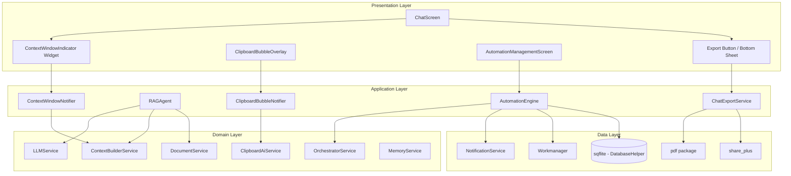

# Design Document: Productivity Features

## Overview

This design covers five high-impact productivity features for AURA Mobile:

1. **Chat Export** — Export conversations as Markdown or PDF, share via platform share sheet
2. **RAG Agent** — Document-grounded Q&A via the existing DocumentService + LLM pipeline
3. **Context Window Indicator** — Real-time token usage and history turn display
4. **Clipboard Bubble UI** — Floating overlay for AI-powered clipboard actions
5. **Automation Engine** — User-configurable scheduled/conditional rules with background execution

All features integrate with the existing Riverpod provider architecture, sqflite database, workmanager background tasks, and the dual-engine LLM service.

### Design Decisions

| Decision | Rationale |
|----------|-----------|
| Add `pdf` package for PDF generation | No existing PDF writing capability; `read_pdf_text` only reads. The `pdf` package is the standard Dart/Flutter solution. |
| Reuse `share_plus` for export sharing | Already a dependency, handles cross-platform share intents. |
| Token estimation via char/4 | Matches the existing ContextBuilderService's implicit assumption and avoids adding a tokenizer dependency. |
| Automation rules in sqflite (not SharedPreferences) | Rules are structured data with relationships; sqflite supports queries, limits, and CRUD. |
| Clipboard bubble as MaterialApp `builder:` overlay | Follows the established `VoiceAssistantOverlay` pattern — ensures the bubble renders above all routes. |
| StateNotifier pattern for all new providers | Matches existing codebase convention (ChatNotifier, etc.). |

## Architecture



## Components and Interfaces

### 1. ChatExportService

**Location:** `lib/features/export/application/chat_export_service.dart`

**Responsibilities:**
- Convert `ChatState.messages` to Markdown format
- Convert `ChatState.messages` to PDF format (via `pdf` package)
- Write temporary files, invoke share_plus, clean up temp files
- Handle errors (empty conversation, storage, timeout)

```dart
final chatExportServiceProvider = Provider((ref) => ChatExportService());

class ChatExportService {
  /// Convert messages to Markdown string.
  /// Pure function — no side effects.
  String convertToMarkdown(List<Map<String, String>> messages);

  /// Generate PDF document bytes from messages.
  /// Returns Uint8List of PDF content.
  /// Throws TimeoutException if generation exceeds 30 seconds.
  /// Throws StorageException if insufficient space.
  Future<Uint8List> generatePdf(List<Map<String, String>> messages);

  /// Export as Markdown: convert, write temp file, share, cleanup.
  Future<ExportResult> exportAsMarkdown(
    List<Map<String, String>> messages,
    BuildContext context,
  );

  /// Export as PDF: generate, write temp file, share, cleanup.
  Future<ExportResult> exportAsPdf(
    List<Map<String, String>> messages,
    BuildContext context,
  );
}

enum ExportResult { success, empty, error, timeout, insufficientStorage }
```

### 2. RAGAgent (Refactored)

**Location:** `lib/features/agents/application/rag_agent.dart`

**Responsibilities:**
- Replace current stub with real document retrieval + LLM grounding
- Call `DocumentService.retrieveRelevantContext()` with limit=10
- Construct RAG prompt with retrieved chunks
- Stream LLM response with appended citations
- Handle edge cases (no results, model not loaded, LLM failure)

```dart
class RAGAgent implements Agent {
  final DocumentService _documentService;
  final ContextBuilderService _contextBuilder;
  final LLMService _llmService;

  @override
  String get name => 'RAGAgent';

  @override
  Future<bool> canHandle(String intent) async => intent == 'document_query';

  @override
  Stream<String> process(String input, {Map<String, dynamic>? context}) async*;

  /// Build a RAG prompt with chunks as grounding context.
  /// Pure function for testability.
  String buildRagPrompt({
    required String query,
    required List<String> chunks,
    required List<String> sourceDocuments,
  });

  /// Format citation list from source document filenames.
  /// Pure function for testability.
  String formatCitations(List<String> sourceDocuments);
}
```

### 3. ContextWindowNotifier

**Location:** `lib/presentation/providers/context_window_provider.dart`

**Responsibilities:**
- Track estimated token count based on assembled prompt
- Calculate turn count from chat history and model tier
- Expose color state (default/amber/red) based on thresholds
- Update reactively when messages change or model tier changes

```dart
enum ContextWindowColorState { normal, warning, critical }

class ContextWindowState {
  final int estimatedTokens;
  final int maxTokens; // 4096
  final int currentTurns;
  final int maxTurns; // 4, 6, or 10 based on tier
  final ContextWindowColorState colorState;
  final ModelTier modelTier;
}

final contextWindowProvider =
    StateNotifierProvider<ContextWindowNotifier, ContextWindowState>((ref) {
  return ContextWindowNotifier(ref);
});

class ContextWindowNotifier extends StateNotifier<ContextWindowState> {
  /// Estimate token count from a string.
  /// Pure function: (charCount / 4).ceil()
  static int estimateTokens(String text);

  /// Determine color state from token count.
  /// Pure function based on thresholds.
  static ContextWindowColorState colorStateForTokens(int tokens, int maxTokens);

  /// Calculate turn count from message history and model tier.
  /// Pure function.
  static int calculateTurns(List<Map<String, String>> messages, ModelTier tier);

  /// Called after each message send/receive to update state.
  Future<void> recalculate(List<Map<String, String>> messages);
}
```

### 4. ClipboardBubbleOverlay & Notifier

**Location:**
- `lib/presentation/widgets/clipboard_bubble_overlay.dart`
- `lib/presentation/providers/clipboard_bubble_provider.dart`

**Responsibilities:**
- Wrap MaterialApp in `builder:` (same pattern as VoiceAssistantOverlay)
- Display floating bubble when clipboard content detected
- Show content type, truncated preview (80 chars max), suggested actions (max 4)
- Handle action execution, AI response streaming, auto-dismiss timer
- Manage bubble lifecycle (show/dismiss/replace/suppress timer)

```dart
enum ClipboardBubbleState { hidden, showing, streaming, completed, error }

class ClipboardBubbleData {
  final ClipboardBubbleState state;
  final ClipboardEvent? event;
  final List<ClipboardAction> actions;
  final String responseText;
  final String? errorMessage;
  final bool timerSuppressed;
}

final clipboardBubbleProvider =
    StateNotifierProvider<ClipboardBubbleNotifier, ClipboardBubbleData>((ref) {
  return ClipboardBubbleNotifier(ref);
});

class ClipboardBubbleNotifier extends StateNotifier<ClipboardBubbleData> {
  /// Truncate text for preview display.
  /// Pure function: if text.length > 80, return text.substring(0,80) + '…'
  static String truncatePreview(String text, {int maxLength = 80});

  /// Show bubble for a clipboard event.
  void showBubble(ClipboardEvent event);

  /// Execute an action and handle streaming response.
  Future<void> executeAction(String actionId);

  /// Dismiss bubble and cancel any active stream.
  void dismiss();
}
```

### 5. AutomationEngine

**Location:**
- `lib/features/automation/application/automation_engine.dart`
- `lib/features/automation/data/automation_repository.dart`
- `lib/features/automation/domain/automation_rule.dart`

**Responsibilities:**
- CRUD operations for automation rules (max 50)
- Validate rule fields (name 1-100 chars, trigger constraints, action 1-500 chars)
- Register/cancel workmanager tasks
- Execute rules in background (dispatch to Orchestrator via workmanager callback)
- Deliver results via flutter_local_notifications
- Transactional guarantees (rollback on workmanager failure)

```dart
final automationEngineProvider = Provider((ref) {
  return AutomationEngine(
    ref.read(automationRepositoryProvider),
    ref.read(orchestratorServiceProvider),
  );
});

class AutomationEngine {
  /// Validate a rule. Returns list of validation errors (empty = valid).
  /// Pure function for testability.
  static List<ValidationError> validateRule(AutomationRule rule);

  /// Create and persist a rule, register workmanager task.
  /// Rolls back on workmanager failure.
  Future<void> createRule(AutomationRule rule);

  /// Update an existing rule (cancel old task, update DB, register new task).
  Future<void> updateRule(AutomationRule rule);

  /// Delete a rule (cancel task, remove from DB).
  Future<void> deleteRule(String ruleId);

  /// Toggle enabled/disabled state.
  Future<void> setEnabled(String ruleId, bool enabled);

  /// Get all rules for management UI.
  Future<List<AutomationRule>> getAllRules();

  /// Execute a rule's action (called from workmanager callback).
  /// Returns the AI response string.
  Future<String> executeRule(AutomationRule rule);

  /// Truncate notification body to 256 chars.
  /// Pure function.
  static String truncateNotification(String response, {int maxLength = 256});
}
```

## Data Models

### AutomationRule

```dart
enum TriggerType { scheduled, recurring, conditionBased }

class AutomationRule {
  final String id;
  final String name;              // 1-100 characters
  final TriggerType triggerType;
  final DateTime? scheduledTime;  // For scheduled: must be in the future
  final Duration? repeatInterval; // For recurring: >= 15 minutes
  final String? condition;        // For condition-based: natural language condition
  final Duration? checkInterval;  // For condition-based: 15min-24h, default 1h
  final String actionInstruction; // 1-500 characters, natural language
  final bool isEnabled;
  final DateTime? lastExecutedAt;
  final DateTime createdAt;
  final DateTime updatedAt;
}
```

### Database Schema (new table, version 5)

```sql
CREATE TABLE automation_rules(
  id TEXT PRIMARY KEY,
  name TEXT NOT NULL,
  triggerType TEXT NOT NULL,
  scheduledTime INTEGER,
  repeatIntervalMinutes INTEGER,
  condition TEXT,
  checkIntervalMinutes INTEGER DEFAULT 60,
  actionInstruction TEXT NOT NULL,
  isEnabled INTEGER DEFAULT 1,
  lastExecutedAt INTEGER,
  createdAt INTEGER NOT NULL,
  updatedAt INTEGER NOT NULL
);
```

### ValidationError

```dart
class ValidationError {
  final String field;
  final String message;
  
  const ValidationError({required this.field, required this.message});
}
```

### ExportResult

```dart
enum ExportResult { success, empty, error, timeout, insufficientStorage }
```

### ContextWindowState

```dart
enum ContextWindowColorState { normal, warning, critical }

class ContextWindowState {
  final int estimatedTokens;
  final int maxTokens;           // 4096
  final int currentTurns;
  final int maxTurns;            // 4 (small), 6 (medium), 10 (large)
  final ContextWindowColorState colorState;
  final ModelTier modelTier;
}
```

## Integration with Existing Components

### OrchestratorService Integration

The RAGAgent replaces the existing stub. The orchestrator already routes `document_query` intent to RAGAgent — we implement the actual logic:

```
User message → IntentDetectionService → document_query → RAGAgent.process()
  → DocumentService.retrieveRelevantContext(query, limit: 10)
  → buildRagPrompt(query, chunks, sourceDocuments)
  → LLMService.chat(ragPrompt)
  → stream response + formatCitations(sources)
```

### Workmanager Integration (Automation)

The existing `callbackDispatcher` in `background_service.dart` will be extended with a new task type:

```dart
if (task == 'automation_rule_task') {
  final ruleId = inputData?['ruleId'] as String?;
  if (ruleId == null) return false;
  
  // Initialize minimal services needed in background isolate
  final db = DatabaseHelper();
  final repository = AutomationRepositoryImpl(db);
  final rule = await repository.getRule(ruleId);
  
  if (rule == null || !rule.isEnabled) return true;
  
  // Execute via LLM in background
  // Deliver result via notification
  // Update lastExecutedAt timestamp
}
```

### ClipboardAiService Integration

The existing `ClipboardAiService` already handles native clipboard detection and action routing. The `ClipboardBubbleOverlay` listens to clipboard events and presents the UI:

```
Native Kotlin → ClipboardAiService._handleMethodCall() → ClipboardEvent
  → ClipboardBubbleNotifier.showBubble(event)
  → User taps action → ClipboardAiService.executeAction(actionId)
  → Stream<String> rendered in bubble OR null → dismiss
```

### ContextBuilderService Integration

The ContextWindowNotifier calls `ContextBuilderService.buildPrompt()` to get the assembled prompt text, then applies `estimateTokens()`:

```
ChatNotifier.sendMessage() 
  → ContextWindowNotifier.recalculate(messages)
  → ContextBuilderService.buildPrompt(lastMessage, chatHistory)
  → estimateTokens(assembledPrompt) → update state
```

### DatabaseHelper Migration

Add `_onUpgrade` case for version 5:

```dart
if (oldVersion < 5) {
  await db.execute('''
    CREATE TABLE automation_rules(
      id TEXT PRIMARY KEY,
      name TEXT NOT NULL,
      triggerType TEXT NOT NULL,
      scheduledTime INTEGER,
      repeatIntervalMinutes INTEGER,
      condition TEXT,
      checkIntervalMinutes INTEGER DEFAULT 60,
      actionInstruction TEXT NOT NULL,
      isEnabled INTEGER DEFAULT 1,
      lastExecutedAt INTEGER,
      createdAt INTEGER NOT NULL,
      updatedAt INTEGER NOT NULL
    )
  ''');
}
```

## Correctness Properties

*A property is a characteristic or behavior that should hold true across all valid executions of a system — essentially, a formal statement about what the system should do. Properties serve as the bridge between human-readable specifications and machine-verifiable correctness guarantees.*

### Property 1: Markdown serialization preserves all messages

*For any* non-empty list of messages (each with a 'role' and 'content' key), the Markdown output produced by `ChatExportService.convertToMarkdown()` SHALL contain every message's role label in bold, a timestamp in "yyyy-MM-dd HH:mm" format, and the full message body, with messages separated by horizontal rules.

**Validates: Requirements 1.1**

### Property 2: PDF generation preserves all messages in order

*For any* list of 1 to 1000 messages, the PDF generated by `ChatExportService.generatePdf()` SHALL contain all message bodies in chronological order (the order of the input list), and the extractable text content of the PDF SHALL contain each message's role label and body text.

**Validates: Requirements 2.1**

### Property 3: RAG prompt contains all retrieved chunks and the user query

*For any* non-empty list of document chunks and any user query string, the prompt produced by `RAGAgent.buildRagPrompt()` SHALL contain every chunk's text content and the user's original query string.

**Validates: Requirements 4.2**

### Property 4: RAG citations list all distinct source documents

*For any* set of retrieved document chunks originating from one or more documents, the citation string produced by `RAGAgent.formatCitations()` SHALL contain exactly one entry per distinct source document filename, with no duplicates and no omissions.

**Validates: Requirements 4.5, 4.7**

### Property 5: Token estimation is ceil(charCount / 4)

*For any* string of length N (where N ≥ 0), `ContextWindowNotifier.estimateTokens(string)` SHALL return `(N / 4).ceil()`, and for an empty string SHALL return 0.

**Validates: Requirements 5.7**

### Property 6: Context indicator color state is determined by token thresholds

*For any* token count T in range [0, 4096], the color state returned by `ContextWindowNotifier.colorStateForTokens(T, 4096)` SHALL be:
- `normal` when T ≤ 3072
- `warning` when 3072 < T ≤ 3686
- `critical` when T > 3686

**Validates: Requirements 5.3, 5.4, 5.5, 5.6**

### Property 7: Turn count equals min(message pairs, tier maximum)

*For any* list of messages and any model tier, `ContextWindowNotifier.calculateTurns(messages, tier)` SHALL return `min(numberOfPairs, maxTurnsForTier)` where numberOfPairs = messages.length ÷ 2 (integer division) and maxTurnsForTier is 4 for small, 6 for medium, 10 for large.

**Validates: Requirements 6.1**

### Property 8: Clipboard preview truncation

*For any* string S, `ClipboardBubbleNotifier.truncatePreview(S)` SHALL return S unchanged if S.length ≤ 80, or return `S.substring(0, 80) + '…'` if S.length > 80.

**Validates: Requirements 7.2**

### Property 9: Automation rule validation accepts valid rules and rejects invalid ones

*For any* AutomationRule, `AutomationEngine.validateRule(rule)` SHALL return an empty list if and only if:
- rule.name.length is between 1 and 100 inclusive
- rule.actionInstruction.length is between 1 and 500 inclusive
- For scheduled triggers: rule.scheduledTime is in the future
- For recurring triggers: rule.repeatInterval >= 15 minutes
- For condition-based triggers: rule.checkInterval is between 15 minutes and 24 hours inclusive

And SHALL return a non-empty list of ValidationErrors identifying each violated constraint otherwise.

**Validates: Requirements 9.2, 9.3, 9.4**

### Property 10: Notification response truncation

*For any* string R, `AutomationEngine.truncateNotification(R)` SHALL return R unchanged if R.length ≤ 256, or return `R.substring(0, 256) + '…'` if R.length > 256.

**Validates: Requirements 10.3**

### Property 11: Execution timestamp always updated

*For any* automation rule execution (whether the Orchestrator returns a successful response or throws an error), the rule's `lastExecutedAt` field in the database SHALL be updated to the current time after execution completes.

**Validates: Requirements 10.6**

## Error Handling

### Strategy by Component

| Component | Error Type | Handling |
|-----------|-----------|----------|
| ChatExportService | Empty messages | Return `ExportResult.empty`, show snackbar |
| ChatExportService | File write failure | Return `ExportResult.error`, clean up partial files, show snackbar |
| ChatExportService | Insufficient storage | Return `ExportResult.insufficientStorage`, show specific message |
| ChatExportService | Timeout (>30s PDF) | Cancel operation, return `ExportResult.timeout`, show message |
| ChatExportService | Share failure | Clean up temp file, show snackbar |
| RAGAgent | Model not loaded | Yield informational message, don't call DocumentService |
| RAGAgent | No matching chunks | Yield "no relevant information found" message |
| RAGAgent | LLM stream failure | Yield error message, retain model loaded state |
| ContextWindowNotifier | ContextBuilder failure | Fall back to last known state, log warning |
| ClipboardBubbleNotifier | executeAction error | Show error state for 2s, then dismiss |
| ClipboardBubbleNotifier | Stream error | Stop loading, display error, retain partial text |
| AutomationEngine | Validation failure | Return ValidationError list, prevent save |
| AutomationEngine | Workmanager registration failure | Rollback DB insert, show error |
| AutomationEngine | Rule execution failure (background) | Send error notification, log, update timestamp |
| AutomationEngine | Max rules reached (50) | Prevent creation, show limit message |

### Error Propagation Pattern

Following the existing `ErrorHandlerService` pattern:
1. Domain-specific exceptions extend `AuraException`
2. Services catch, wrap, and rethrow as typed exceptions
3. UI layer catches typed exceptions and maps to user-facing messages
4. Non-critical failures (cleanup, notifications) are logged but don't propagate

### Transactional Safety (Automation Engine)

```dart
Future<void> createRule(AutomationRule rule) async {
  // 1. Validate
  final errors = validateRule(rule);
  if (errors.isNotEmpty) throw ValidationException(errors);
  
  // 2. Check limit
  final count = await _repository.getRuleCount();
  if (count >= 50) throw LimitExceededException('Maximum 50 rules');
  
  // 3. Persist to DB
  await _repository.insertRule(rule);
  
  // 4. Register workmanager task
  try {
    await _registerTask(rule);
  } catch (e) {
    // ROLLBACK: remove from DB on workmanager failure
    await _repository.deleteRule(rule.id);
    rethrow;
  }
}
```

## Testing Strategy

### Unit Tests (Pure Functions)

These test the core logic without mocks or side effects:

| Function | Test Approach |
|----------|--------------|
| `ChatExportService.convertToMarkdown()` | Property + example tests with various message lists |
| `RAGAgent.buildRagPrompt()` | Property test — all chunks and query present in output |
| `RAGAgent.formatCitations()` | Property test — deduplication of source documents |
| `ContextWindowNotifier.estimateTokens()` | Property test — ceil(N/4) for all N |
| `ContextWindowNotifier.colorStateForTokens()` | Property test — threshold boundaries |
| `ContextWindowNotifier.calculateTurns()` | Property test — min(pairs, tierMax) |
| `ClipboardBubbleNotifier.truncatePreview()` | Property test — truncation at 80 chars |
| `AutomationEngine.validateRule()` | Property test — valid/invalid input classification |
| `AutomationEngine.truncateNotification()` | Property test — truncation at 256 chars |

### Property-Based Testing Configuration

- **Library:** `dart_check` (Dart property-based testing, or use `test` package with custom generators)
- **Minimum iterations:** 100 per property
- **Tag format:** `Feature: productivity-features, Property {number}: {property_text}`

Each correctness property above maps to one property-based test. Generators will produce:
- Random message lists (varying lengths 1-1000, roles from {'user', 'assistant'}, content with Unicode)
- Random strings of varying lengths (0 to 10000 chars) for truncation tests
- Random token counts (0 to 5000) for threshold tests
- Random AutomationRule instances (valid and invalid configurations)
- Random document chunk sets with varying source documents

### Widget Tests

| Widget | What's Tested |
|--------|---------------|
| ContextWindowIndicator | Renders correct token count, color changes at thresholds, turn count display |
| ClipboardBubbleOverlay | Appears on event, shows preview, action taps invoke service, auto-dismiss timer |
| AutomationManagementScreen | Form validation, rule list display, enable/disable toggle, delete confirmation |
| Export Bottom Sheet | Format selection, loading state during PDF gen, error snackbars |

### Integration Tests

| Flow | What's Verified |
|------|-----------------|
| RAG end-to-end | Intent detection → RAGAgent → DocumentService → LLM → response with citations |
| Automation create/execute | Create rule → workmanager registered → callback fires → notification delivered |
| Export flow | Messages → Markdown/PDF → temp file → share_plus called → cleanup |
| Clipboard action flow | Native event → bubble shown → action tap → AI response stream in bubble |

### Mocking Strategy

- **LLMService**: Mock for unit tests (avoid loading real model)
- **DocumentService**: Mock `retrieveRelevantContext()` return values
- **Workmanager**: Mock task registration/cancellation (can't run real background tasks in test)
- **share_plus**: Mock share invocation
- **DatabaseHelper**: Use in-memory sqflite for repository tests
- **NotificationService**: Mock notification delivery
- **ClipboardAiService**: Mock native channel responses
